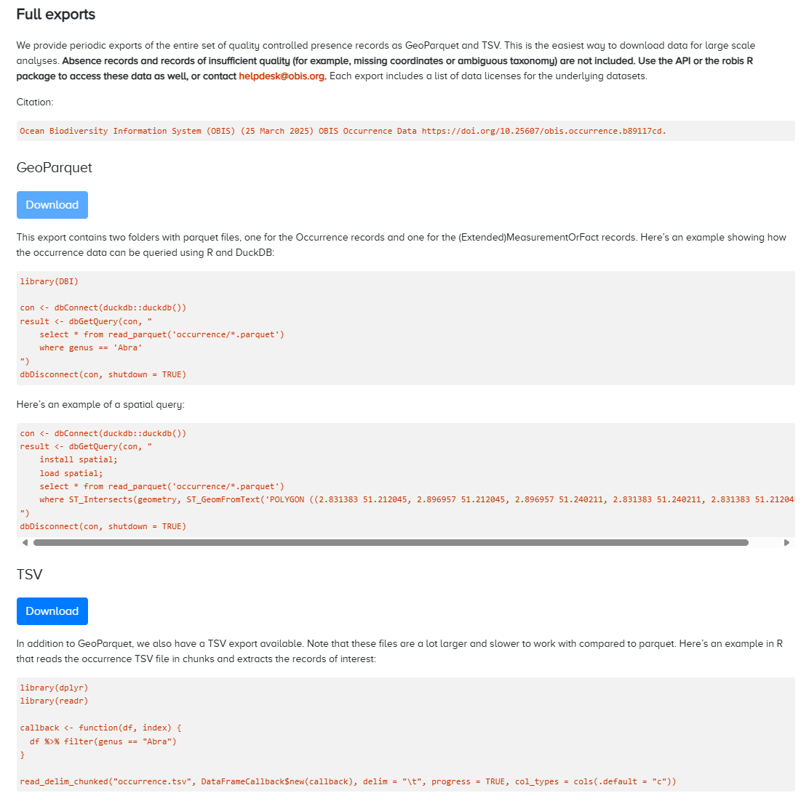

# (PART\*) Access Data from OBIS {-}

# Data access

OBIS has over 100 million records of marine data accessible for downloading. To download data from OBIS, there are several options:

* [OBIS homepage](https://obis.org/) or [advanced dataset search](https://obis.org/datasets)
* [OBIS Mapper](https://mapper.obis.org)
* Accessible through the [R package robis](https://github.com/iobis/robis)
* OBIS [API](https://api.obis.org/)
* [Full data exports](#full-exports)
* [IPT](ipt.html)

<div class="callbox-blue">

`r fontawesome::fa("flag", fill="darkblue", prefer_type="solid")` When you download data from the Mapper or full export, the data you will receive is flattened into one table with occurrence plus event data. eMoF data tables are separate upon request. However when you download a dataset from the OBIS homepage or dataset page, all tables (Event, Occurrence, eMoF) are separate files. By default absence and dropped records are not included in downloads and can be obtained through the API or the robis package.

</div>

## OBIS Homepage and dataset pages

From the OBIS homepage, you can search for data in the search bar in the middle of the page. You can search by particular taxonomic groups, common names, dataset names, OBIS nodes, institute name, areas (e.g., Exclusive Economic Zone (EEZ)), or by the data provider’s country.

When you search by dataset you will notice an additional option appears for [advanced search options](https://obis.org/datasets). This will allow you to identify specific datasets, and apply filters for OBIS nodes and whether datasets include extensions.

{width=90%}

Regardless if you found a dataset through the homepage or the advanced Dataset search, you will be able to navigate to individual dataset pages. For individual dataset pages (instead of aggregate pages for e.g., a Family) there are three buttons available:

* Report issue - allows you to report any issues with the dataset in question
* Source DwC-A - download the original dataset as a Darwin Core-Archive file. This will provide all data tables as separate files within a zipped folder and will not include any of the OBIS QC fields
* To mapper - this will open another browser with the data shown in the Mapper

{width=90%}

When you download data from the source DwC-A, you will obtain csv of the datatables and two other metadata files: eml.xml and meta.xml.

If you searched for aggregate datasets (e.g., all Crustacea records, all records from OBIS-Canada, etc.), the `source DwC-A` button will not be available to you. To download these data subsets, you must click `to mapper` and then [download the data from the Mapper as a CSV](#mapper).

## Mapper

* <https://mapper.obis.org>

Watch this video demonstration `r fontawesome::fa(name="youtube", fill="red")` of how to use the Mapper as well as the OBIS homepage search.

  <iframe width="560" height="315"
src="https://www.youtube.com/embed/9PSPEtqgjUI"
frameborder="0"
allow="accelerometer; autoplay; encrypted-media; gyroscope; picture-in-picture"
allowfullscreen></iframe>

The mapper allows users to visualize and inspect subsets of OBIS data. A variety of filters are available (taxonomic, geographic, time, data quality) and multiple layers can be combined in a single view. Layers can be downloaded as CSV files.

{width=60%}

When you download data from the mapper, you will be given the option to include eMoF and/or DNA Derived Data extensions alongside the Event and Occurrence data. You must check the boxes of extensions you want to include in your download. Note that absence records are not included in downloads from the Mapper.

{width=70%}

After downloading, you will notice that the Event and Occurrence data is flattened into one table, called “Occurrence.csv”. Upon inspecting this file in your viewer of choice, you will see it contains all 225 possible DwC fields, although not every field will contain data for each observation. Any extensions you checked will be downloaded as separate tables. Fields added by the OBIS QC pipeline are also included in this download. You will also see a JSON file query.json that records your search parameters, and an HTML file called citations. It is important that if you are using the data downloaded you must ensure they are all cited according to the license.

## R package

* <https://github.com/iobis/robis>

The robis R package has been developed to facilitate connecting to the OBIS API from R. The package can be installed [from CRAN](https://cran.r-project.org/web/packages/robis/index.html) or [from GitHub](https://github.com/iobis/robis) (latest development version). The package documentation includes a [Reference](https://iobis.github.io/robis/reference/index.html) page outlining all functions, as well as a [getting started vignette](https://iobis.github.io/robis/articles/getting-started.html). For example, you can use the package to obtain a list of datasets, a taxon checklist, or raw occurrence data by supplying e.g. a taxon name or AphiaID. You can also specify whether to include **absence or dropped records** when obtaining occurrence data.

If you’d like to then download this data, you can simply export R objects with the `write.csv` function. If we wanted to obtain Mollusc data from OBIS, some options would be:

```R
library(robis)

#obtain occurrence data
moll<-occurrence("Mollusca")
moll_abs<-occurrence(“Mollusca”, absence="include") #include absence records
write.csv(moll, “mollusca-obis.csv”)

#obtain a list of datasets
molldata<-dataset(scientificname="Mollusca")

#obtain a checklist of Mollusc species in a certain area
mollcheck<-checklist(scientificname="Mollusca", geometry = "POLYGON ((2.3 51.8, 2.3 51.6, 2.6 51.6, 2.6 51.8, 2.3 51.8))")
```

This file will be saved to your working directory (if you are not familiar with working directories, read [here](https://bookdown.org/ndphillips/YaRrr/the-working-directory.html)). After opening the file, you will notice that the fields in the download do not include every possible field, but instead only those where information has been recorded by data providers, plus the [fields added by OBIS’s quality control pipeline](#interpreting-downloaded-files-from-obis).

To use `robis` for visualizing and mapping occurrences, see the [Visualization](dataviz.html) section of the manual.

Watch the video `r fontawesome::fa(name="youtube", fill="red")` below for a walkthrough of how to use the robis package to obtain OBIS data.

  <iframe width="560" height="315"
src="https://www.youtube.com/embed/8Ep4fGICQWU"
frameborder="0"
allow="accelerometer; autoplay; encrypted-media; gyroscope; picture-in-picture"
allowfullscreen></iframe>

## API

* <https://api.obis.org/>

Both the Mapper and the R package are based on the [OBIS API](https://api.obis.org/), which can also be used to find data. When using the API directly, you can filter by the following options:

* Occurrence
* Taxon
* Checklist
* Node
* Dataset
* Institute
* Area
* Country
* Facet
* Statistics

When you have entered all the information you are interested in filtering by, scroll down and click the “Execute” button. This will produce a response detailing how many records match your criteria, as well as information for some of the headers from the data (e.g., basisOfRecord, Order, genus, etc.). A download button will be available for you, although we don't recommend using the API interface to download data as it only provides the first 10 results. The API interface may be best used for quick data summaries. Do note that the API allows you to specify whether to include absence records in some filters.

When searching with the API, you may need to know certain identifiers, including:

* AphiaID - obtainable from the WoRMS page of a taxa of interest (e.g. the AphiaID for [Mollusca](https://www.marinespecies.org/aphia.php?p=taxdetails&id=51) would be 51)
* Dataset UUID - can be obtained from the URL on individual dataset pages
  * E.g., [this dataset’s](https://obis.org/dataset/5061d21c-6161-4ea2-a8d4-38f8285dfc47) UUID would be 5061d21c-6161-4ea2-a8d4-38f8285dfc47
* Area ID
* Institute ID - this should be the Ocean Expert ID (e.g., the ID for [NOAA Fisheries Service, Southeast Regional Office St. Petersburg](https://oceanexpert.org/institution/7532) is 7532)
* OBIS node UUID

A short video `r fontawesome::fa(name="youtube", fill="red")` demonstrating use of the API user interface is shown below.

  <iframe width="560" height="315"
src="https://www.youtube.com/embed/Hocr3N6zpH0"
frameborder="0"
allow="accelerometer; autoplay; encrypted-media; gyroscope; picture-in-picture"
allowfullscreen></iframe>

## Full exports

* <https://obis.org/data/access/>

To obtain a full export of OBIS data, navigate to the OBIS homepage, click on Data from the top navigation bar, then select [Data Access](https://obis.org/data/access/) from the dropdown menu.


Here you will be able to download all occurrence records as a GeoParquet or TSV file. Note the disclaimer that such exports will not include records of insufficient quality, or absence records. As with downloads from the Mapper, the data will include the 68 fields added by the OBIS QC Pipeline, including taxonomic information obtained from WoRMS. Each export also includes a list of data licenses for the underlying datasets.



## Finding your own data in OBIS

To find your own dataset in OBIS, you can use the same tools as finding any dataset in OBIS. You have the following options:

* From the [OBIS homepage](https://obis.org/) or the [Mapper](https://mapper.obis.org/), you can search by dataset name, species of interest, the OBIS node that you uploaded to, or by institute
  * Note: When using the Mapper you can combine multiple search criteria to help narrow down your search
    * E.g., if we wanted to find [this dataset](https://obis.org/dataset/80479e14-2730-436d-acaa-b63bdc7dd06f) in the Mapper, we could search for OBIS USA under Nodes, National Oceanic and Atmospheric Administration, Washington under Institutes, and/or Radiozoa under Scientific Name. Then when we view the data and scroll down to datasets, the only one listed is the one we were interested in
* If you have used the (extended)measurementOrFact extension and have `measurementType` data, you can [search by the name of your `measurementType`](https://mof.obis.org/), and click on the hyperlink for records. This will populate a list of datasets that you can scroll through which have used a particular `measurementType`. _Note this tool is only for consultatation purposes and should never be used to help you [select vocabulary](vocabulary.html#map-emof-measurement-identifiers-to-preferred-vocabulary) for your data_

## How to contact a data provider

To contact the data provider, navigate to the page for the individual dataset in question (e.g., <https://obis.org/dataset/80479e14-2730-436d-acaa-b63bdc7dd06f>). Under the “Contacts” section, there will be a list of individuals you can contact. Clicking any name will direct you to your system’s default email program. For example:

{width=70%}

If you are the node manager and need to contact the data provider about a particular dataset, contact information should be provided in the metadata and you can contact them from information provided.

## Interpreting downloaded files from OBIS

In general, the field names you will see when you download data from OBIS are the same as those seen during the data formatting and publishing process. When you download data from the [Mapper](https://mapper.obis.org/) you will see all 225 possible Darwin Core fields.

Downloading data from an IPT will include only the fields provided by the data provider, formatted as one Occurrence file (or separate files for individual datasets). 

Some fields are added through the OBIS quality control pipeline, including taxonomic information from WoRMS and the fields `flags`, `bathymetry`, and `dropped`. As mentioned in the [Quality Control section](dataquality.html), the fields `flags` and `dropped` will list quality control issues or if the record was dropped, respectively. Details and definitions for all fields added by the OBIS QC pipeline can be found [here](https://obis.org/data/access/).

For a full list of the other Darwin Core terms and their definitions included in downloads, please reference the [Darwin Core reference guide](https://dwc.tdwg.org/terms/).
