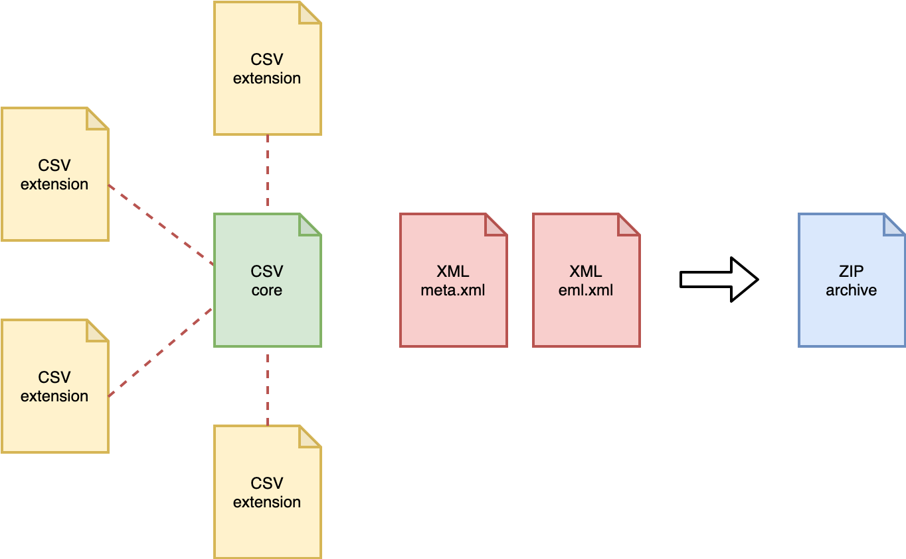

### Darwin Core Archive

**Contents**

- [Darwin Core Archive](#darwin-core-archive)
- [OBIS holds more than just species occurrences: the ENV-DATA approach](#obis-holds-more-than-just-species-occurrences-the-env-data-approach)
  - [ExtendedMeasurementOrFact Extension (eMoF)](#extendedmeasurementorfact-extension-emof)
  - [eDNA & DNA derived data Extension](#edna-dna-derived-data-extension)
  - [A special case: habitat types](#a-special-case-habitat-types)
- [When to use Event Core](#when-to-use-event-core)
- [When to use Occurrence Core](#when-to-use-occurrence-core)
- [Recommended reading](#recommended-reading)

#### Darwin Core Archive

Darwin Core Archive (DwC-A) is the standard for packaging and publishing biodiversity data using Darwin Core terms. It is the preferred format for publishing data in OBIS and GBIF. The format is described in the [Darwin Core text guide](https://dwc.tdwg.org/text/). A Darwin Core Archive contains a number of text files, including data tables formatted as CSV.

The conceptual data model of the Darwin Core Archive is a star schema with a single core table, for example containing occurrence records or event records, at the center of the star. Extension tables can optionally be associated with the core table. It is not possible to link extension tables to other extension tables (to form a so-called snowflake schema). There is a one-to-many relationship between the core and extension records, so each core record can have zero or more extension records linked to it, and each extension record must be linked to exactly one core record. Definitions for the core and extension tables can be found [here](http://rs.gbif.org/).

Besides data tables, a Darwin Core Archive also contains two XML files: one file which describes the archive and data file structure (`meta.xml`), and one file which contains the dataset's metadata (`eml.xml`).

Figure: structure of a Darwin Core Archive.

#### OBIS holds more than just species occurrences: the ENV-DATA approach

Data collected as part of marine biological research often include measurements of habitat features (such as physical and chemical parameters of the environment), biotic and biometric measurements (such as body size, abundance, biomass), as wel as details regarding the nature of the sampling or observation methods, equipment, and sampling effort.

In the past, OBIS relied solely on the [Occurrence Core](http://rs.gbif.org/core/dwc_occurrence_2015-07-02.xml), and additional measurements were added in a structured format (e.g. JSON) in the Darwin Core term `dynamicProperties` inside the occurrence records. This approach had significant downsides: the format is difficult to construct and deconstruct, there is no standardization of terms, and attributes which are shared by multiple records (think sampling methodology) have to be repeated many times. The formatting problem can be addressed by moving measurements to a [MeasurementOrFacts](http://rs.gbif.org/extension/dwc/measurements_or_facts.xml) extension table, but that doesn't solve the redundancy and standardization problems.

With the release and adoption of a new core type [Event Core](http://rs.gbif.org/core/dwc_event_2015_05_29.xml) it became possible to associate measurements with nested events (such as cruises, stations, and samples), but the restrictive star schema of Darwin Core archive prohibited associating measurements with the event records in the Event core as well as with the occurrence records in the Occurrence extension. For this reason an extended version of the existing MeasurementOrFact extension was created.

##### ExtendedMeasurementOrFact Extension (eMoF)

As part of the IODE pilot project [Expanding OBIS with environmental data OBIS-ENV-DATA](https://www.iode.org/index.php?option=com_content&view=article&id=463&Itemid=100200), OBIS introduced a custom [ExtendedMeasurementOrFact](http://rs.gbif.org/extension/obis/extended_measurement_or_fact.xml) or eMoF extension, which extends the existing [MeasurementOrFact](http://rs.gbif.org/extension/dwc/measurements_or_facts.xml) extension with 4 new terms:

- `occurrenceID`
- `measurementTypeID`
- `measurementValueID`
- `measurementUnitID`

The `occurrenceID` term is used to circumvent the limitations of the star schema, and link measurement records in the ExtendedMeasurementOrFact extension to occurrence records in the Occurrence extension. Note that in order to comply with the Darwin Core Archive standard, these records still need to link to an event record in the Event core table as well. Thanks to this term we can now store a variety of measurements and facts linked to either events or occurrences:

- organism quantifications (e.g. counts, abundance, biomass, % live cover, etc.)
- species biometrics (e.g. body length, weight, etc.)
- facts documenting a specimen (e.g. living/dead, behaviour, invasiveness, etc.)
- abiotic measurements (e.g. temperature, salinity, oxygen, sediment grain size, habitat features)
- facts documenting the sampling activity (e.g. sampling device, sampled area, sampled volume, sieve mesh size).

Figure: Overview of an OBIS-ENV-DATA format. Sampling parameters, abiotic measurements, and occurrences are linked to events using the eventID (full lines). Biotic measurements are linked to occurrences using the new occurrenceID field of the ExtendedMeasurementOrFact Extension (dashed lines).

##### eDNA & DNA derived data Extension

DNA derived data are increasingly being used to document taxon occurrences. To ensure these data are useful to the broadest possible community, GBIF published a guide entitled [Publishing DNA-derived data through biodiversity data platforms](https://docs.gbif-uat.org/publishing-dna-derived-data/1.0/en/). This guide is supported by the DNA derived data extension for Darwin Core, which incorporates MIxS terms into the Darwin Core standard. eDNA and DNA derived data is linked to occurrence data with the use of `occurrenceID` and/ or `eventID`. Refer to the [Examples: ENV-DATA and DNA derived data](dna_data.html) for use case examples of eDNA and DNA derived data. 

##### A special case: habitat types

Including information on habitats (biological community, biotope, or habitat type) is possible and encouraged with the use of Event Core. However, beware the unconstrained nature of the terms `measurementTypeID`, `measurementValueID`, and `measurementUnitID` which can lead to inconsistently documented habitat measurements within the Darwin Core Archive standard. To ensure this data is more easily discoverable, understood or usable, refer to [Examples: habitat data](other_data_types.html#habitat-data) and/or [Duncan et al. (2021)](https://emodnet.ec.europa.eu/en/reports?field_emodnet_lot_value[]=seabed_habitats#h3298bcd0a15741a8a0ac1c8b4576f7c5) for use case examples and more details.

##### Recommended reading

* [De Pooter et al. 2017](https://bdj.pensoft.net/articles.php?id=10989). Toward a new data standard for combined marine biological and environmental datasets - expanding OBIS beyond species occurrences. Biodiversity Data Journal 5: e10989. hdl.handle.net/10.3897/BDJ.5.e10989
* [Duncan et al. (2021)](https://emodnet.ec.europa.eu/en/reports?field_emodnet_lot_value[]=seabed_habitats#h3298bcd0a15741a8a0ac1c8b4576f7c5). A standard approach to structuring classified habitat data using the Darwin Core Extended Measurement or Fact Extension. EMODnet report.
  *(Note you must refine search to Technical Reports from 2021 to identify Duncan et al.'s report)*
