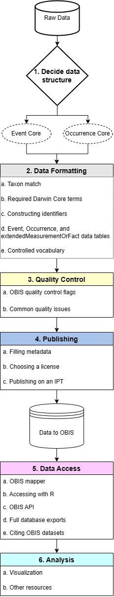

## OBIS Data Life Cycle

The basic data life cycle for contributions to OBIS can be broken down into six step-by-step phases:

1.  Data structure
2.  Data formatting
3.  Quality control
4.  Publishing
5.  Data access (downloading)
6.  Data visualization

Each of these phases are outlined in this manual and are composed of a number of steps which are covered in the relevant sections.

After you have decided on your [data structure](formatting.llms.md) and have moved to the Data Formatting stage, you must first [match](name_matching.llms.md) the taxa in your dataset to a registered list. In formatting your dataset you will ensure the [required OBIS terms](checklist.llms.md) and [identifiers](identifiers.llms.md) are mapped correctly to your data fields and records.

Depending on your data structure, you will then format data into a [DwC-A](data_format.llms.md) format with the appropriate Core table ([Event](format_event.llms.md) or [Occurrence](format_occurrence.llms.md)) with any applicable extension tables. Any biotic or abiotic measurements will be moved into the [extendedMeasurementOrFact table](format_emof.llms.md). Before proceeding to the [publishing](data_publication.llms.md) stage, there are a number of [quality control](dataquality.llms.md) steps to complete.

Once your data has been published, you and others can [access](access.llms.md) datasets through various avenues and it becomes part of OBIS’ global database!

This may seem like a daunting process at first glance, but this manual will walk you through each step, and the OBIS community is full of [helpful resources](gethelp.llms.md). Throughout the manual you will find tutorials and tools to guide you from start to finish through the OBIS data life cycle.

  

#### Who is responsible for each phase?

Phases 1 through 3 are the responsibilities of the data provider, while Phases 3 and 4 are shared between the data provider and the node manager. Data users are involved in Phases 5 and 6.

The OBIS Secretariat is responsible for data processing and harvesting published resources.

## Biodiversity data standards

From the very beginning, OBIS has championed the use of international standards for biogeographic data. Without agreement on the application of standards and protocols, OBIS would not have been able to build a large central database. OBIS uses the following standards:

- [Darwin Core](darwin_core.llms.md)
- [Ecological Metadata Language](eml.llms.md)
- [Darwin Core Archive and dataset structure](data_format.llms.md)

The following pages of this manual review each of these in turn. We show you how to apply these standards to format your data in the [Data Formatting](formatting.llms.md) section.

We also provide some [dataset examples](examples.llms.md) for your reference.
