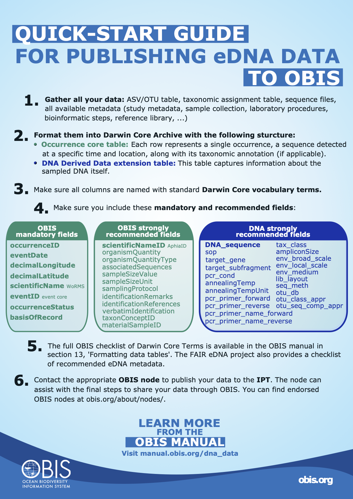
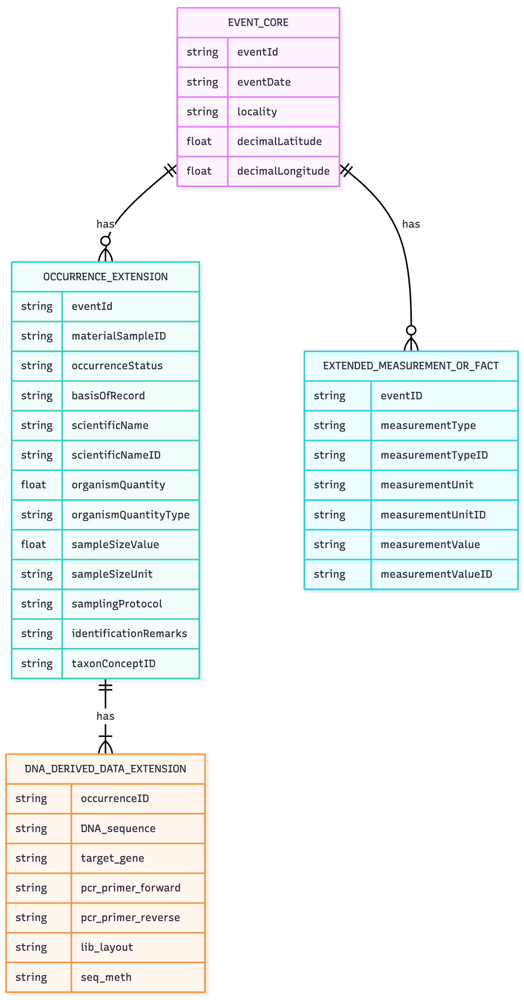

## DNA derived data


</div>

**Contents:**

- [Introduction](#introduction-to-dna-data)
- [Quick start guide](#quick-start-guide)
- [How to find genetic data in OBIS](#how-to-find-genetic-data-in-obis)
- [Guidelines for compiling eDNA and metabarcoding data](#compiling-edna-and-metabarcoding-datasets)
  - [Using Occurrence core and DNA Derived Data extension](#using-occurrence-core-and-dna-derived-data-extension)
  - [Using the event core, occurrence extension, and DNA Derived Data extension](#using-the-event-core-occurrence-extension-and-dna-derived-data-extension)
  - [Using the metabarcoding data toolkit](#using-the-metabarcoding-data-toolkit)
  - [Unknown sequences](#unknown-sequences)
  - [Sequences without a WoRMS-ID (AphiaID)](#sequences-without-a-worms-id-aphiaid)
  - [Control samples](#control-samples)
  - [Try it out yourself](#try-it-out-yourself)
- [eDNA and DNA derived data example](#edna-and-dna-derived-data-example)
  - [eDNA data from Monterey Bay, California](#edna-data-from-monterey-bay-california)
  - [16S rRNA metabarcoding example](#16s-rrna-gene-metabarcoding-data-of-pico-to-mesoplankton)
- [Guidelines for compiling qPCR data](#compiling-qpcr-datasets)
- [OBIS Bioinformatics pipeline](#obis-bioinformatics-pipeline)
- [Future developments of eDNA data standards](#future-developments-of-edna-data-standards)

### Introduction to DNA data {.unlisted .unnumbered}

DNA derived data are increasingly being used to document taxon occurrences. This genetic data may come from a sampling event, an individual organism, may be linked to physical material (or not), or may result from DNA detection methods e.g., metabarcoding or qPCR. Thus genetic data may reflect a single organism, or may include information from bulk samples with many individuals. Still, DNA-derived occurrence data of species should be documented as standardized and as reproducible as possible.

To ensure DNA data are useful to the broadest possible community, a community guide entitled [Publishing DNA-derived data through biodiversity data platforms](https://docs.gbif-uat.org/publishing-dna-derived-data/1.0/en/) was published by GBIF, OBIS, and others. This guide is supported by the [DNA derived data extension for Darwin Core](http://rs.gbif.org/extension/gbif/1.0/dna_derived_data_2021-07-05.xml), which incorporates MIxS terms into the Darwin Core standard. There are 5 categories for which genetic data could fall into:  

1. DNA-derived occurrences
2. Enriched occurrences
3. Targeted species detection
4. Name references
5. Metadata only

For a guide and decision tree on determining which category your data falls into, see the [Data packaging and mapping](https://docs.gbif.org/publishing-dna-derived-data/1.0/en/#data-packaging-and-mapping) section of the GBIF guide. Refer to the [examples below](dna_data.html#edna--dna-derived-data) for use case examples of eDNA and DNA derived data (Category 1).

> Genetic data may now be published using either the **Occurrence core** and DNA-derived data extension, or by utilising the **Event core** and adding both an occurrence extension and the DNA-derived data extension. eDNA and DNA derived data are linked to the Occurrence core data table with the use of `occurrenceID` and/or `eventID`. The DNA derived data can also be linked to both the Event core (by using `eventID`) and the Occurrence extension (by using the `occurrenceID`). Use of the Event core can help in decreasing the amount of data, as metadata linked to samples is recorded only once.  See below for further guidance on compiling genetic data. In addition, a [new data model](https://www.gbif.org/new-data-model) is being developed by GBIF and the OBIS community that would enable the linking of multiple different datatypes and tables , and will get rid of the start schema, enabling the linking of one sequence to multiple occurrences, therefore decreasing the amount of data needed. However as it is not implemented yet (as of September 2025), we focus on the current Darwin Core recommendations here.
 

To format datasets, you will need to have information on the sequence and possible taxonomy for each occurrence record associated with a DNA sample. Genetic data is often recorded in multiple different files, and this might be the type of format received from data providers. Important data tables can include: an OTU-table, a taxonomy table, a sample information table, and a .fasta file with sequences. The OTU-table is a sequence by sample table, which records the quantity of each unique sequence found in each sample. Sequences are usually referred to by an ID, which is unique only in the dataset (e.g. asv1, asv2, asv3 …). The taxonomy table is a sequence by taxonomy table, which records the taxonomy linked to each unique sequence, as defined by the annotation method. The sample information table records the metadata of each sample (e.g. location, time, and collection method).  Finally the .fasta file records the actual DNA sequence that is linked to each sequence id.

Although this data is in multiple files, each unique sequence by sample combination is considered **one** occurrence. Therefore the data from these tables will need to be formatted to the “long format”, including a row for each sequence in each sample. See the figure below for a demonstration of how this can be done.


Doing this will help you when following the guidelines below.


### Quick start guide



### How to find genetic data in OBIS {.unlisted .unnumbered}

To find genetic data in OBIS we recommend using the R package robis, using the `occurrence` function. You must set `extensions` and/or `hasextensions` to "DNADerivedData" to ensure extension records are included in the results. `hasextensions` will exclude any occurrence that does not have the specified extension, in our case, DNADerivedData. The `extensions` parameter specifies which extensions to include. To obtain the DNA data, you have to extract the information from the extension using the `unnest_extension()` function. You can specify as many fields from the Occurrence table to be included, and pass them to the `fields` parameter. See the code below for an example. See also this [vignette](https://iobis.github.io/notebook-dnaderiveddata/) for a more detailed example, including how you can work further with these sequences in R.

```R
dna_occ<-occurrence("Dinophyceae",hasextensions="DNADerivedData", extensions="DNADerivedData")
dnaseqs <-unnest_extension(dna_datasets, "DNADerivedData", fields = c("id", "phylum", "class", "family", "genus", "species"))
dnaseqs["DNA_sequence"]
# A tibble: 706 × 1
   DNA_sequence                                                                                              
   <chr>                                                                                                     
 1 AGCTCCAATAGCGTATATTAAAGTTGTTGCAGTTAAAACGCTCGTAGTCGGATTTCGGGGCGGGCCGACCGGTCTGCCGATGGGTATGCACTGGCCGGCGCGTCC…
 2 AGCTCCAATAGCGTATATTAAAGTTGTTGCAGTTAAAACGCTCGTAGTCGGATTTCGGGGCGGGCCGACCGGTCTGCCGATGGGTATGCACTGGCCGGCGCGTCC…
 3 GCTCCTACCGATTGAATGATCCGGTGAGGCCCCCGGACTGCGGCGCCGCAGCTGGTTCTCCAGCCGCGACGCCGCGGGAAGCTGTCCGAACCTTATCATTTAGAG…
 4 AGCTCCAATAGCGTATATTAAAGTTGTTGCAGTTAAAACGCTCGTAGTCGGATTTCGGGGCGGGCCGACCGGTCTGCCGATGGGTATGCACTGGCCGGCGCGTCC…
 5 AGCTCCAATAGCGTATATTAAAGTTGTTGCAGTTAAAACGCTCGTAGTCGGATTTCGGGGCGGGCCGACCGGTCTGCCGATGGGTATGCACTGGCCGGCGCGTCC…
 6 GCTCCTACCGATTGAATGATCCGGTGAGGCCCCCGGACTGCGGCGCCGCAGCTGGTTCTCCAGCCGCGACGCCGCGGGAAGCTGTCCGAACCTTATCATTTAGAG…
 7 AGCTCCAATAGCGTATATTAAAGTTGTTGCAGTTAAAACGCTCGTAGTCGGATTTCGGGGCGGGCCGACCGGTCTGCCGATGGGTATGCACTGGCCGGCGCGTCC…
 8 AGCTCCAATAGCGTATATTAAAGTTGTTGCAGTTAAAACGCTCGTAGTCGGATTTCGGGGCGGGCCGACCGGTCTGCCGATGGGTATGCACTGGCCGGCGCGTCC…
 9 GCTCCTACCGATTGAATGATCCGGTGAGGCCCCCGGACTGCGGCGCCGCAGCTGGTTCTCCAGCCGCGACGCCGCGGGAAGCTGTCCGAACCTTATCATTTAGAG…
10 AGCTCCAATAGCGTATATTAAAGTTGTTGCAGTTAAAACGCTCGTAGTCGGATTTCGGGGCGGGCCGACCGGTCTGCCGATGGGTATGCACTGGCCGGCGCGTCC…
# … with 696 more rows
```

Additionally, a prototype [Sequence Search tool](https://sequence.obis.org/) is in development that allows you to search for sequences or related sequences in OBIS. Note that the tool is not always up to date so please use caution until the prototype is fully developed. To use the tool:

1. Copy your sequence in the provided box (an example sequence is provided for testing)
2. Press the Search button
3. View results below
4. You can also change the Minimum Alignment Score slider in the map view to see location of sequences

The search result will show you taxonomic information for species sequences that align to your sequence, the alignment score, and a link to the respective datasets.

**OBIS Mapper**

You can use the [OBIS Mapper](https://mapper.obis.org/) to obtain records that include the DNADerivedData extension by addding a filter for the extension when using the tool. To do this:

1. From the OBIS Mapper, navigate to the Criteria tab (the plus (+) sign)
2. Open the Extensions dropdown section
3. Check the box for DNADerivedData
4. Add any other filters you want, e.g. taxonomic, then click save to create the layer
5. Switch to the Layers tab
6. Download the data from the layer by clicking the green button (see [Data Access](access#mapper.html) for more on using the OBIS Mapper)

**Tutorial resources**

To run through an example of accessing data in OBIS you can access [this training](https://github.com/iobis/obon-2024-dna-training ) held for the Ocean Biomolecular Observation Network (OBON) in 2024.

### Compiling eDNA and metabarcoding datasets

#### Using Occurrence core and DNA Derived Data extension

As mentioned above, you will need to have information on the taxonomy and sequences for each occurrence record associated with a DNA sample. You should first fill in the [Occurrence core table](format_occurrence.html), and then complete the DNA Derived Data extension (as well as the eMoF extension, if applicable, for any measurements taken).

**Occurrence core table**
In addition to the [usual required terms for Occurrence datasets](format_occurrence.html), you should consider the following additional terms:

- Class Occurrence | DwC: organismQuantity
- Class Occurrence | DwC: OrganismQuantityType
- Class Occurrence| DwC: associatedSequences
- Class Event | DwC: sampleSizeValue
- Class Event | DwC: sampleSizeUnit
- Class Event | DwC: samplingProtocol
- Class Identification | DwC: identificationRemarks
- Class Identification | DwC: identificationReferences
- Class Identification | DwC: verbatimIdentification
- Class Taxon | DwC: taxonConceptID
- Class Material Sample | DwC:materialSampleID

For `organismQuantity` and `sampleSizeValue` in eDNA datasets, the quantities recorded with sequencing studies always represent **relative abundance to the total reads in the sample**, and cannot be directly compared across samples. This is due to the nature of the sample processing protocol and the amplification of DNA with PCR, which biases the original quantities. In `organismQuantity`, record the **amount of a unique sequence in a specific sample** (i.e. 33 reads). In `sampleSizeValue`, record the **total number of all reads** in that specific sample (i.e. 15310 reads). This information will allow people accessing the data to calculate the relative abundance of that sequence in the sample. The fields `organismQuantityType`, and `sampleSizeUnit`, should be populated with “DNA sequence reads”, as it is of high importance that sequence abundances are not confused with organism abundances recorded by traditional methods. The abundance information can usually be found in the “OTU-table”.

`associatedSequences` should contain a reference to the URL domain where genetic sequence information associated with the Occurrence can be found, e.g. a link, identifier, or list (concatenated and separated) of identifiers. Can link to archived raw barcode reads and/or associated genome sequences, like a public repository. It is recommended that links contain the domain name (e.g. NCBI) in the URL, for example: https://www.ncbi.nlm.nih.gov/bioproject/PRJNA887898/. The actual sequence of the occurrence will be documented in the DNA Derived Data extension.

`identificationRemarks` should be used to record information on how the taxonomic information of the occurrence was reached against which reference database, and, if possible, with which confidence. For example “RDP annotation confidence: 0.96, against reference database: GTDB”. This information should be recorded in the bioinformatic protocol of the study. Note: this information will also be recorded in the DNA derived extension in the fields `otu_seq_comp_appr` and `otu_db`.

`identificationReferences` should include a link to the bioinformatic pipeline or publication where the identification process is explained in detail.

`taxonConceptID` should include the taxonomic ID of the sequence (non-Linnean). Often genetic sequences can be assigned an ID linked to a reference database that is not a linnean name. These taxonomic names or IDs from other taxonomic databases (like the NCBI taxonomic database) can be recorded in this field. For example: NCBI:txid9771. The name linked to this ID can then be recorded in the field `verbatimIdentification`.

`samplingProtocol` can contain free-text that briefly describes the methods used to obtain the sample, or a link to a protocol that is recorded elsewhere.

**DNA Derived Data extension**
The DNADerivedData extension is meant to capture information related to the sampled DNA, including sampling, processing, and other bioinformatic methods. The following (free-text) terms are required or highly recommended for eDNA and metabarcoding datasets. Note that some terms will be different for qPCR data (see [below](#compiling-qpcr-datasets))

- DNA Derived | DwC: DNA_sequence
- DNA Derived | DwC: sop
- DNA Derived | DwC: target_gene
- DNA Derived | DwC: target_subfragment
- DNA Derived | DwC: pcr_primer_forward
- DNA Derived | DwC: pcr_primer_reverse
- DNA Derived | DwC: pcr_primer_name_forward
- DNA Derived | DwC: pcr_primer_name_reverse
- DNA Derived | DwC: pcr_primer_reference
- DNA Derived | DwC: Pcr_cond
- DNA Derived | DwC: annealingTemp
- DNA Derived | DwC: annealinTempUnit
- DNA Derived | DwC: ampliconSize
- DNA Derived | DwC: env_broad_scale
- DNA Derived | DwC: env_local_scale
- DNA Derived | DwC: env_medium
- DNA Derived | DwC: lib_layout
- DNA Derived | DwC: seq_meth
- DNA Derived | DwC: otu_class_appr
- DNA Derived | DwC: otu_seq_comp_appr
- DNA Derived | DwC: otu_db

For a complete list of terms you can map to, see [the DwC DNA Derived Data extension page](http://rs.gbif.org/extension/gbif/1.0/dna_derived_data_2021-07-05.xml). See the [examples below](dna_data.html#edna--dna-derived-data) for use case examples. The Marine Biological Data Mobilization Workshop also has a [tutorial](https://ioos.github.io/bio_mobilization_workshop/edna-extension.html) for this type of data.

`DNA_sequence` is the most important field, where the ASV/OTU sequence will be recorded. This field can then be searched with sequence alignment methods to, for example, find closely related sequences recorded in other studies, and will allow very powerful data comparison and analysis in the future. It will also make your sequence available in the [OBIS sequence search tool](https://sequence.obis.org/).

The remaining metadata fields will help the person accessing the data to filter data of interest (e.g. specific genetic region with `target_gene`, `target_subfragment`, or `pcr_primer` fields), link to the public sequence databases with the MixS specific fields (e.g. `env_` fields), and evaluate the reliability of the sequence annotation method (e.g. `otu_` fields).

Environmental systems are described in the two fields `env_broad_scale` and `env_local_scale` and it is recommended to use [Environment Ontology (ENVO)’s biome classes](https://ontobee.org/ontology/ENVO?iri=http://purl.obolibrary.org/obo/ENVO_00000428) to describe the environmental system from which the sample was extracted. Like other identifiers, provide the exact ENVO reference identifier. `env_broad_scale` provides a coarse resolution for which environment your sample came from. Likely this will be [marine biome (ENVO:00000447)](https://ontobee.org/ontology/ENVO?iri=http://purl.obolibrary.org/obo/ENVO_00000447) for OBIS data. For local scale, identify the specific environment your sample was obtained from (e.g., coastal water, benthic zone, etc.).

When data tables are formatted and you are ready to publish it on the IPT, it will follow the same process for [publishing on an IPT](data_publication.html). You will upload your source files, and add the Occurrence core Darwin Core mappings, and then the DNA Derived Data Darwin Core mappings. However the extension must first be [installed by the IPT administrator](data_publication.html#ipt-administration) (often the node manager). Once the extension is installed, you can add the Darwin Core DNA Derived Data mapping for that file.

#### Using the event core, occurrence extension, and DNA Derived Data extension

Using event core with DNA derived data may be helpful in cases where there is a lot of different information linked to the same samples. The workflow and required terms are in practice the same; as each Occurrence depicts a sequence in a location and time, it is necessary to copy the occurrence for each sample (i.e. format the OTU table with taxonomic information into a long format dataset). 

Simply, by adding the `occurrenceID` to the DNA derived data table, a link between the occurrence extension table and the event core table can be made. 

The following image shows the general structure of a dataset using event core, occurrence extension, and DNA derived data extension. 



#### Using the metabarcoding data toolkit

eDNA data can also be formatted using the [metabarcoding data toolkit](https://mdt.obis.org/). In this toolkit, you can upload your typical data files:

- An OTU table
- A taxonomy table
- A fasta file
- A sample information table
- Metadata file

The purpose of the toolkit is to simplify the step of data formatting of eDNA data. A comprehensive [manual](https://docs.gbif-uat.org/mdt-user-guide/en/) for the toolkit is available from gbif. For example, there are instructions in the manual on how to get datasets suitable for MDT directly from the phyloseq format, which is an output of the Phyloseq R-package, commonly used for community analyses of sequence data.

The MDT, similar to the IPT, helps with mapping fields to the correct darwin core terms. It also gives an overview of the sample composition and geographic location, allowing the user to check for any mistakes in the data. From MDT, the user can then export a ready-made darwin-core archive file, or a standardized biom-formatted file. This can then be published to OBIS through the IPT. It is also possible to publish through the [GBIF MDT](https://mdt.gbif.org/), in cases where you are affiliated with a GBIF publishing node. In this case you can indicate that the dataset should also be shared to OBIS, through the associated networks field when publishing. 

The MDT also provides a possibility to opt for assigning taxonomy to sequences. However, considering the uniqueness of each eDNA dataset, and the general nature of this assignment tool, we do not currently recommend assigning taxonomy through the MDT toolkit. 

The MDT toolkit is designed for typical eDNA dataset: i.e. OTU/ASV tables and their associated metadata. It is not able to bioinformatically process raw sequencing data or handle metagenomic datasets or other DNA-associated biodiversity data types like specimen barcodes or qPCR data.
The MDT is most useful when getting started with eDNA data formatting to Darwin Core. For large datasets or projects with regular outputs, we recommend developing a workflow script for formatting the datasets to darwin core, as these can easily be reused without manual work. 

#### Unknown sequences

It is important to understand the significance of unknown and uncharacterized sequences in genetic studies. Sequences are given taxonomic names based on comparisons to a reference database. The reference databases contain sequences that have been submitted with a name. Ideally, the reference database is a collection of sequences that are derived from vouchered, morphologically identified specimens. Notably, this is frequently often not the case and sequences can also have erratic annotations. Furthermore, only a small portion of species have sequences in reference databases. Due to this reason, typically many sequences in any given study will remain uncharacterized. This is especially the case for tropical regions with high biodiversity. By also recording all sequences, including uncharacterized sequences, we make sure that the information is not lost, even if the annotation is currently incorrect or missing. These uncharacterized sequences can then still be compared to other studies, and can be given a taxonomic name as more specimens are sequenced and added to the reference databases.

For unknown sequences it is required to populate the `scientificName` field with **“Biota incertae sedis”**, or the lowest taxonomic information if available. For example, if it is only known which Class a sequence belongs to, populate `scientificName` with the associated Class name. Similarly, `scientificNameID` should be populated with the WoRMS LSID for the name given to `scientificName`. For records recorded as Biota *incertae sedis*, `scientificNameID` should be populated with [urn:lsid:marinespecies.org:taxname:12](https://www.marinespecies.org/aphia.php?p=taxdetails&id=12). We recommend also populating `verbatimIdentification` with the name that was originally documented (e.g. phototrophic eukaryote).

#### Sequences without a WoRMS-ID (AphiaID)

As indicated, OBIS uses the WoRMS database as its only taxonomic backbone. WoRMS keeps up-to-date records of linnean names of marine species, confirmed by experts in each taxonomic group. However, as WoRMS is in the process of adding more protists and prokaryotes to their database, within eDNA datasets there are usually many taxonomic assignments that cannot be found in the WoRMS database currently (i.e. no AphiaID available). In many cases due to GBIF combining several taxonomic backbones, a name might be available and mapped to GBIF, making sharing datasets between GBIF and OBIS complicated. Therefore, **the submitter of the data may in these cases record the known species name, in `scientificName`, the ID of the taxon in another database in `taxonConceptID` and leave `scientificNameID` empty.** (Note; this is different from the case above, where no assignment has been made, or the assignment has only been made to a higher taxonomic level.) The OBIS ingestion workflow will be updated soon (end 2025) to allow searching for higher taxonomic levels that may be available in WoRMS and automatically adding these to the dataset, as well as the name of the corresponding `scientificName`, while keeping the original submitted species name in `originalScientificName`. In this way, all known species names are kept, while also enabling the mapping of the full datasets to OBIS with the best available information. 

#### Control samples

The recommended way to connect control samples to your dataset, is to submit them as a separate files within the same dataset, that will not be mapped to avoid that they end up in the GBIF or OBIS occurrence indexes. In this way they are available for anyone who is looking for further information on your dataset, but it will not be confusing in the global OBIS search. **Currently (October 2025), this feature has not been implemented yet in IPT (see https://github.com/gbif/ipt/issues/2109).** 


#### Try it out yourself

To run through a simple example of formatting DNA data to OBIS, and an example dataset to try out the MDT tool, you can access [this training](https://github.com/iobis/obon-2024-dna-training) held for the Ocean Biomolecular Observation Network (OBON) in 2024. 


### eDNA and DNA derived data example

The following example use cases draw on both the [DNA-derived data guide](https://docs.gbif-uat.org/publishing-dna-derived-data/1.0/en/) and the [DNA derived data extension](https://rs.gbif-uat.org/extensions.html#http) to illustrate how to incorporate a DNA derived data extension file into a Darwin Core archive. Note: for the purposes of this section, only required Occurrence core terms are shown, in addition to all eDNA & DNA specific terms. For additional Occurrence core terms, refer to [Occurrence](darwin_core.html#occurrence).

#### eDNA data from Monterey Bay, California

The data for this example is from the use case ["18S Monterey Bay Time Series: an eDNA data set from Monterey Bay, California, including years 2006, 2013 - 2016'](https://ipt-obis.gbif.us/resource?r=18s_monterey_bay_time_series_edna). The data from this study originate from marine filtered seawater samples that have undergone metabarcoding of the 18S V9 region.

**Occurrence core:**

We can populate the Occurrence core with all the required and highly recommended fields, as well as considering the eDNA and DNA specific fields. The Occurrence core contain the taxonomic identification of each ASV observed; its number of reads, as well as relevant metadata including the sample collection location, references for the identification procedure, and links to archived sequences.

`OccurrenceID` and `basisOfRecord` are some of the required Occurrence core terms, in addition to the highly recommended fields of `organismQuantity` and `organismQuantityType`. A selection of samples from this plate were included in another publication (Djurhuus et al., 2020),which is recorded in `identificationReferences` along with the GitHub repository where the data can be found.

| occurrenceID               | basisOfRecord  | organismQuantity | OrganismQuantityType | associatedSequences                   |
|----------------------------|----------------|------------------|----------------------|---------------------------------------|
| 11216c01_12_edna_1_S_occ1  | MaterialSample | 19312            | DNA sequence reads   | NCBI BioProject acc. nr. PRJNA433203  |
| 11216c01_12_edna_2_S_occ1  | MaterialSample | 16491            | DNA sequence reads   | NCBI BioProject acc. nr. PRJNA433203  |
| 11216c01_12_edna_3_S_occ1  | MaterialSample | 21670            | DNA sequence reads   | NCBI BioProject acc. nr. PRJNA433203  |

| sampleSizeValue | sampleSizeUnit      | identificationReferences                        | identificationRemarks                                 |
|-----------------|---------------------|-------------------------------------------------|-------------------------------------------------------|
| 147220          | DNA sequence reads  | GitHub repository  [Djurhuus et al. 2020](https://doi.org/10.1038/s41467-019-14105-1) | unassigned, Genbank nr Release 221 September 20 2017  |
| 121419          | DNA sequence reads  | GitHub repository  [Djurhuus et al. 2020](https://doi.org/10.1038/s41467-019-14105-1) | unassigned, Genbank nr Release 221 September 20 2017  |
| 161525          | DNA sequence reads  | GitHub repository  [Djurhuus et al. 2020](https://doi.org/10.1038/s41467-019-14105-1) | unassigned, Genbank nr Release 221 September 20 2017  |

**DNA Derived Data extension:**

Next, we can create the **DNA Derived Data extension** which will be connected to the Occurrence core with the use of `occurrenceID`. This extension contains the DNA sequences and relevant DNA metadata, including sequencing procedures, primers used and SOP's. The recommended use of ENVO's biome classes were applied to describe the environmental system from which the sample was extracted. The samples were collected by CTD rosette and filtered by a peristaltic pump system. Illumina MiSeq metabarcoding was applied for the target_gene 18S and the target_subfragment, V9 region. URL's are provided for the protocols followed for nucleic acids extraction and amplification.

For a detailed description of the steps taken to process the data, including algorithms used, see the original publication. Adding Operational Taxonomic Unit (OTU) related data are highly recommended and should be as complete as possible, for example:

| occurrenceID               | env-broad_scale              | env_local_scale               | env_medium                                    |
|----------------------------|------------------------------|-------------------------------|-----------------------------------------------|
| 11216c01_12_edna_1_S_occ1  | marine biome (ENVO:00000447) | coastal water (ENVO:00001250) | waterborne particulate matter (ENVO:01000436) |
| 11216c01_12_edna_2_S_occ1  | marine biome (ENVO:00000447) | coastal water (ENVO:00001250) | waterborne particulate matter (ENVO:01000436) |
| 11216c01_12_edna_3_S_occ1  | marine biome (ENVO:00000447) | coastal water (ENVO:00001250) | waterborne particulate matter (ENVO:01000436) |

| samp_vol_we_dna_ext | nucl_acid_ext                            | nucl_acid_amp                            | lib_layout  | target_gene |
|---------------------|------------------------------------------|------------------------------------------|-------------|-------------|
| 1000ml              | [dx.doi.org/10.17504/protocols.io.xjufknw](https://www.protocols.io/view/mbari-environmental-dna-edna-extraction-using-qiag-bp2l647d5vqe/v1) | [dx.doi.org/10.17504/protocols.io.n2vdge6](https://www.protocols.io/view/environmental-dna-edna-18s-metabarcoding-illumina-6qpvrydzgmkn/v2) | paired      | 18S         |
| 1000ml              | [dx.doi.org/10.17504/protocols.io.xjufknw](https://www.protocols.io/view/mbari-environmental-dna-edna-extraction-using-qiag-bp2l647d5vqe/v1) | [dx.doi.org/10.17504/protocols.io.n2vdge6](https://www.protocols.io/view/environmental-dna-edna-18s-metabarcoding-illumina-6qpvrydzgmkn/v2) | paired      | 18S         |
| 1000ml              | [dx.doi.org/10.17504/protocols.io.xjufknw](https://www.protocols.io/view/mbari-environmental-dna-edna-extraction-using-qiag-bp2l647d5vqe/v1) | [dx.doi.org/10.17504/protocols.io.n2vdge6](https://www.protocols.io/view/environmental-dna-edna-18s-metabarcoding-illumina-6qpvrydzgmkn/v2) | paired      | 18S         |

| target_subfragment  | seq_meth             | otu_class_appr   | otu_seq_comp_appr                                                           |
|---------------------|----------------------|------------------|-----------------------------------------------------------------------------|
| V9                  | Illumina MiSeq 2x250 | dada2;1.14.0;ASV | blast;2.9.0+;80% identity;e-value cutoff: x  MEGAN6;6.18.5;bitscore: 100 :2% |
| V9                  | Illumina MiSeq 2x250 | dada2;1.14.0;ASV | blast;2.9.0+;80% identity;e-value cutoff: x  MEGAN6;6.18.5;bitscore: 100 :2% |
| V9                  | Illumina MiSeq 2x250 | dada2;1.14.0;ASV | blast;2.9.0+;80% identity;e-value cutoff: x  MEGAN6;6.18.5;bitscore: 100 :2% |

| otu_db         | sop                                                           | DNA_sequence     |
|----------------|---------------------------------------------------------------|------------------|
| Genbank nr;221 | [dx.doi.org/10.17504/protocols.io.xjufknw](https://www.protocols.io/view/mbari-environmental-dna-edna-extraction-using-qiag-bp2l647d5vqe/v1) or GitHub repository | GCTACTACCGATT... |
| Genbank nr;221 | [dx.doi.org/10.17504/protocols.io.xjufknw](https://www.protocols.io/view/mbari-environmental-dna-edna-extraction-using-qiag-bp2l647d5vqe/v1) or GitHub repository | GCTACTACCGATT... |
| Genbank nr;221 | [dx.doi.org/10.17504/protocols.io.xjufknw](https://www.protocols.io/view/mbari-environmental-dna-edna-extraction-using-qiag-bp2l647d5vqe/v1) or GitHub repository | GCTACTACCGATT... |

| pcr_primer_forward | pcr_primer_reverse       | pcr_primer_name_forward | pcr_primer_name_reverse | pcr_primer_reference       |
|--------------------|--------------------------|-------------------------|-------------------------|----------------------------|
| GTACACACCGCCCGTC   | TGATCCTTCTGCAGGTTCACCTAC | 1391f                   | EukBr                   | Amaral-Zettler et al. 2009 |
| GTACACACCGCCCGTC   | TGATCCTTCTGCAGGTTCACCTAC | 1391f                   | EukBr                   | Amaral-Zettler et al. 2009 |
| GTACACACCGCCCGTC   | TGATCCTTCTGCAGGTTCACCTAC | 1391f                   | EukBr                   | Amaral-Zettler et al. 2009 |

#### 16S rRNA gene metabarcoding data of Pico to Mesoplankton

DNA derived datasets can also include an extendedMeasurementsOrFact (eMoF) extension file, in addition to the Occurrence and DNA derived extensions. In this example, environmental measurements were provided in an eMoF file, in addition to the DNA derived data and occurrence data. Here we show how to incorporate such measurements in the extensions.

In the publication ["Diversity of Pico- to Mesoplankton along the 2000 km Salinity Gradient of the Baltic Sea"](https://www.frontiersin.org/articles/10.3389/fmicb.2016.00679/full), a dataset with 16S rRNA gene metabarcoding data of surface water microbial communities was created from 21 off-shore stations, following a transect from Kattegat to the Gulf of Bothnia in the Baltic Sea. The full dataset entitled ["Diversity of Pico- to Mesoplankton along the 2000 km Salinity Gradient of the Baltic Sea (Hu et al. 2016)](https://www.gbif.org/dataset/9e29a2fe-d780-48a8-a93f-9ce041f9202f) is available from GBIF.

**Occurrence core:**

The Occurrence core contain information about the organisms in the sample including the taxonomy and quantity of organisms detected, the collection location, references for the identification procedure, and links to the sequences generated.

**Important note: even though this dataset uses OTU identifiers for taxonomy (therefore not including ```scientificNameID```) OBIS still recommends using ```scientificNameID```.**

| basisOfRecord  | occurrenceID                                      | eventID          | eventDate           |
|----------------|---------------------------------------------------|------------------|---------------------|
| MaterialSample | SBDI-ASV-3:16S_1:919a2aa9d306e4cf3fa9ca02a2aa5730 | SBDI-ASV-3:16S_1 | 2013-07-13 07:08:00 |
| MaterialSample | SBDI-ASV-3:16S_1:43e088977eba5732bfa45e20b1d8cdd2 | SBDI-ASV-3:16S_1 | 2013-07-13 07:08:00 |
| MaterialSample | SBDI-ASV-3:16S_1:887bc7033b46d960e893caceb711700b | SBDI-ASV-3:16S_1 | 2013-07-13 07:08:00 |

| organismQuantity | organismQuantityType | sampleSizeValue | sampleSizeUnit     |
|------------------|----------------------|-----------------|--------------------|
| 2235             | DNA sequence reads   | 12393           | DNA sequence reads |
| 795              | DNA sequence reads   | 12393           | DNA sequence reads |
| 40               | DNA sequence reads   | 12393           | DNA sequence reads |

| samplingProtocol                                                                                                                            | associatedSequences                                 | identificationReferences                                                             | identificationRemarks                                                                                                             |
|---------------------------------------------------------------------------------------------------------------------------------------------|-----------------------------------------------------|--------------------------------------------------------------------------------------|-----------------------------------------------------------------------------------------------------------------------------------|
| 200–500 mL seawater were filtered onto 0.22 μm pore-size mixed cellulose ester membrane filters; [https://doi.org/10.3389/fmicb.2016.00679] | [https://www.ebi.ac.uk/ena/browser/view/ERR1202034] | [https://docs.biodiversitydata.se/analyse-data/molecular-tools/#taxonomy-annotation] | DADA2:assignTaxonomy:addSpecies annotation against sbdi-gtdb=R06-RS202-1; confidence at lowest specified (ASV portal) taxon: 0.5  |
| 200–500 mL seawater were filtered onto 0.22 μm pore-size mixed cellulose ester membrane filters; [https://doi.org/10.3389/fmicb.2016.00679] | [https://www.ebi.ac.uk/ena/browser/view/ERR1202034] | [https://docs.biodiversitydata.se/analyse-data/molecular-tools/#taxonomy-annotation] | DADA2:assignTaxonomy:addSpecies annotation against sbdi-gtdb=R06-RS202-1; confidence at lowest specified (ASV portal) taxon: 0.56 |
| 200–500 mL seawater were filtered onto 0.22 μm pore-size mixed cellulose ester membrane filters; [https://doi.org/10.3389/fmicb.2016.00679] | [https://www.ebi.ac.uk/ena/browser/view/ERR1202034] | [https://docs.biodiversitydata.se/analyse-data/molecular-tools/#taxonomy-annotation] | DADA2:assignTaxonomy:addSpecies annotation against sbdi-gtdb=R06-RS202-1; confidence at lowest specified (ASV portal) taxon: 0.99 |

| decimalLatitude | decimalLongitude | taxonID                              | scientificName     |
|-----------------|------------------|--------------------------------------|--------------------|
| 55.185          | 13.791           | ASV:919a2aa9d306e4cf3fa9ca02a2aa5730 | UBA6821            |
| 55.185          | 13.791           | ASV:43e088977eba5732bfa45e20b1d8cdd2 | Chthoniobacterales |
| 55.185          | 13.791           | ASV:887bc7033b46d960e893caceb711700b | BACL27 sp014190055 |

| kingdom  | phylum            | class            | order              | family             | genus   |
|----------|-------------------|------------------|--------------------|--------------------|---------|
| Bacteria | Verrucomicrobiota | Verrucomicrobiae | Chthoniobacterales | UBA6821            | UBA6821 |
| Bacteria | Verrucomicrobiota | Verrucomicrobiae | Chthoniobacterales | NA                 | NA      |
| Bacteria | Actinobacteriota  | Acidimicrobiia   | Acidimicrobiales   | Ilumatobacteraceae | BACL27  |

**DNA Derived Data extension:**

The DNA Derived Data extension for metabarcoding data contains the DNA sequences and relevant DNA metadata, primers and procedures. This example table contains the highly recommended and recommended fields as populated with the example dataset data. For this dataset, authors additionally provided measurements of of water sample temperature and salinity, which are provided in an **extendedMeasurementOrFact** extension file:

| id                                                | env_broad_scale               | env_local_scale              | env_medium                     |
|---------------------------------------------------|-------------------------------|------------------------------|--------------------------------|
| SBDI-ASV-3:16S_1:919a2aa9d306e4cf3fa9ca02a2aa5730 | aquatic biome [ENVO_00002030] | marine biome [ENVO_00000447] | brackish water [ENVO_00002019] |
| SBDI-ASV-3:16S_1:43e088977eba5732bfa45e20b1d8cdd2 | aquatic biome [ENVO_00002030] | marine biome [ENVO_00000447] | brackish water [ENVO_00002019] |
| SBDI-ASV-3:16S_1:887bc7033b46d960e893caceb711700b | aquatic biome [ENVO_00002030] | marine biome [ENVO_00000447] | brackish water [ENVO_00002019] |

| lib_layout | target_gene | target_subfragment | seq_meth       | sop                       |
|------------|-------------|--------------------|----------------|---------------------------|
| paired     | 16S rRNA    | V3-V4              | Illumina MiSeq | <https://nf-co.re/ampliseq> |
| paired     | 16S rRNA    | V3-V4              | Illumina MiSeq | <https://nf-co.re/ampliseq> |
| paired     | 16S rRNA    | V3-V4              | Illumina MiSeq | <https://nf-co.re/ampliseq> |

| pcr_primer_forward | pcr_primer_reverse    | pcr_primer_name_forward | pcr_primer_name_reverse | DNA_sequence           |
|--------------------|-----------------------|-------------------------|-------------------------|------------------------|
| CCTACGGGNGGCWGCAG  | GACTACHVGGGTATCTAATCC | 341                     | 805R                    | TCGAGAATTTTTCACAATG... |
| CCTACGGGNGGCWGCAG  | GACTACHVGGGTATCTAATCC | 341                     | 805R                    | TCGAGAATTTTTCACAATG... |
| CCTACGGGNGGCWGCAG  | GACTACHVGGGTATCTAATCC | 341                     | 805R                    | TGGGGAATCTTGCGCAATG... |

**extendedMeasurementOrFact (eMoF) extension:**

| measurementID                | occurrenceID                                      | measurementType | measurementValue | measurementUnit |
|------------------------------|---------------------------------------------------|-----------------|------------------|-----------------|
| SBDI-ASV-3:16S_1:temperature | SBDI-ASV-3:16S_1:919a2aa9d306e4cf3fa9ca02a2aa5730 | temperature     | 16.9             | °C              |
| SBDI-ASV-3:16S_1:salinity    | SBDI-ASV-3:16S_1:919a2aa9d306e4cf3fa9ca02a2aa5730 | salinity        | 7.25             | psu             |
| SBDI-ASV-3:16S_1:temperature | SBDI-ASV-3:16S_1:1ead98754d34073a4606f7ff1e94126e | temperature     | 16.9             | °C              |


### Compiling qPCR datasets

Compiling qPCR data is a little bit different than compiling eDNA or metabarcoding data. One of the main differences is that there are no sequences recorded in the `DNA_sequence` field of the DNA derived data extension. Instead, occurrences are based on detections made using species-specific primers and either qPCR (Quantitative Polymerase Chain Reaction) or ddPCR (Droplet-Digital Polymerase Chain Reaction), no sequencing is done.

It is very important to document the methods used for this type of data because the results can be sensitive to the specificity of the primers/assays used. Therefore documenting as much detail on the methodologies is important to ensure data interpretability.

**Occurrence core table**
In addition to the Occurrence core terms, it is strongly recommend to including the following terms for qPCR data:

- Class Occurrence | DwC:recordedBy
- Class Occurrence | DwC: organismQuantity
- Class Occurrence | DwC: organismQuantityType
- Class Event | DwC: sampleSizeValue
- Class Event | DwC: sampleSizeUnit
- Class Event | DwC: samplingProtocol
- Class Material Sample | DwC:materialSampleID

For ddPCR, `organismQuantity` refers to the **number of positive droplets/chambers in the sample**, and `organismQuantityType` is the partition type (e.g., ddPCR droplets, dPCR chambers). `sampleSizeValue` will be populated with the **number of accepted partitions**, e.g. meaning accepted droplets in ddPCR or chambers in dPCR. `sampleSizeUnit` is the partition type, which should be the same as `organismQuantityType`. All four of these fields are particularly important to include for ddPCR data.

For qPCR, these fields can be used for recording e.g. the number of copies that were calculated for the target gene in the sample. In this case `organismQuantityType` needs to contain the exact type of the measurement reported in the results. The field accepts any string, but the best practice would be to add a URI pointing to a vocabulary, as is done in the extendedMeasurementOrFact extension. The terms `sampleSizeValue` and `sampleSizeUnit` would not be used in this case.

`materialSampleID` should contain an identifier for the MaterialSample (i.e. occurrence record), rather than a digital record of the material sample. If an ID was obtained from a nucleotide archive, use the associated biosample ID. Otherwise, construct a persistent unique identifier from a combination of elements in the data that will make the `materialSampleID` globally unique, similar to eventIDs and occurrenceIDs.

`recordedBy` can be populated with the names of the people, groups, or organizations responsible for recording the original Occurrence. You can use a concatenated list for multiple names, by separating values with a vertical bar (' | ').

**DNA Derived Data extension**
For qPCR  datasets, it is strongly recommended to document as much detail as possible in this extension, particularly details about the PCR primers used and the target gene. We recommend you include the following terms, where relevant. For term definitions see [DNA derived data extension](https://rs.gbif.org/extension/gbif/1.0/dna_derived_data_2022-02-23.xml).

*Terms related to the sampling event:*

- DNA Derived | DwC: env_broad_scale
- DNA Derived | DwC: env_local_scale
- DNA Derived | DwC: env_medium
- DNA Derived | DwC: samp_collect_device
- DNA Derived | DwC: samp_mat_process
- DNA Derived | DwC: samp_size
- DNA Derived | DwC: size_frac

*Terms related to DNA and PCR methods:*

- DNA Derived | DwC: sop
- DNA Derived | DwC: concentration
- DNA Derived | DwC: concentrationUnit
- DNA Derived | DwC: methodDeterminationConcentrationAndRatios
- DNA Derived | DwC: contaminationAssessment
- DNA Derived | DwC: target_gene
- DNA Derived | DwC: target_subfragment
- DNA Derived | DwC: ampliconSize
- DNA Derived | DwC: amplificationReactionVolume
- DNA Derived | DwC: amplificationReactionVolumeUnit
- DNA Derived | DwC: baselineValue
- DNA Derived | DwC: automaticBaselineValue
- DNA Derived | DwC: automaticThresholdQuantificationCycle
- DNA Derived | DwC: thresholdQuantificationCycle
- DNA Derived | DwC: pcr_analysis_software
- DNA Derived | DwC: pcr_primer_forward
- DNA Derived | DwC: pcr_primer_reverse
- DNA Derived | DwC: pcr_primer_name_forward
- DNA Derived | DwC: pcr_primer_name_reverse
- DNA Derived | DwC: pcr_primer_reference
- DNA Derived | DwC: pcr_cond
- DNA Derived | DwC: pcr_primer_lod
- DNA Derived | DwC: pcr_primer_loq
- DNA Derived | DwC: annealingTemp
- DNA Derived | DwC: annealinTempUnit
- DNA Derived | DwC: probeQuencher
- DNA Derived | DwC: probeReporter
- DNA Derived | DwC: quantificationCycle
- DNA Derived | DwC: ratioOfAbsorbance260_230
- DNA Derived | DwC: ratioOfAbsorbance260_280

There are many specialized qPCR terms that are possible to add to the dataset. The terms `concentration`, `concentrationUnit`, `ratioOfAbsorbance260_230`, `ratioOfAbsorbance260_280`, and `methodDeterminationConcentrationAndRatios` are related to the original DNA sample before qPCR analysis, and can be useful for evaluating the prevalence of the marker in the sample as well as the purity of the DNA for any indication of PCR inhibition.

As with the metabarcoding dataset, the details of the PCR conditions and primers can be recorded in the multiple `pcr_` terms as well as `target_` terms, and `amplificationReactionVolume` and `amplificationReactionVolumeUnit`.

The main terms that are important for the quantification information and are different from the metabarcoding dataset are `baselineValue`, `thresholdQuantificationCycle` and `quantificationCycle`. The terms `pcr_primer_lod`, `pcr_primer_loq`, `probeQuencher`, `probeReporter` are additional terms specific for qPCR assays. The `baselineValue` indicates the number of cycles below which the signal is considered only background noise. The `quantificationCycle` is the most important and indicates at which cycle the particular sample crossed the detection threshold, this will be different for each sample. It is recommended to record this information, but not all of this may be easily available.


### OBIS Bioinformatics Pipeline

OBIS recognizes the vast amount of data generated from marine DNA sampling, especially from eDNA sequencing. Thus we have been developing a bioinformatics pipeline to facilitate publication of this data into OBIS. The pipeline was initially developed for the [PacMAN project (Pacific Islands Marine Bioinvasions Alert Network)](https://pacman.obis.org/).

Broadly speaking, it creates a framework that receives raw sequence data from eDNA samples, cleans, aligns, classifies sequences, and finally outputs a DwC-compatible table. To note, the pipeline automatically searches for aphia-IDs from WoRMS to include in the DWC-compatible tables. In addition the output also contains a phyloseq object, which is compatible with the commonly used phyloseq R package for sequence data analysis. The pipeline is under active development. More details about the PacMAN pipeline can be found on its [associated GitHub repository](https://github.com/iobis/PacMAN-pipeline).

OBIS is developing guidelines and pipelines to accept other data types, such as:

- [Acoustic](other_data_types.html#multimedia-data)
- [Imaging](other_data_types.html#multimedia-data)
- [Tracking](other_data_types.html#tracking-data)
- [Habitat](other_data_types.html#habitat-data)

### Future developments of eDNA data standards

#### FAIRe checklist development

The project “Making eDNA data FAIR” led by Miwa Takahashi from CSIRO was a community-led effort to improve eDNA data standardization and the terms available for its use. A list of 138 terms were developed combining MixS and DwC terms, and developing new terms where they were deemed necessary. Extensive documentation of the group’s work and the outputs is available on the [project website](https://fair-edna.github.io/index.html). 

At the moment (September 2025), the project team is working with the Genomic Standards Consortium (GSC) to define a MixS extension from these terms. The team will also work with TDWG to suggest new DwC terms. The expectation is that these terms will be available also for the DNA-derived data extension in the next year(s). 

The FAIRe terms include critical terms for each eDNA processing step; including among others sampling, PCR protocols, bioinformatics and analysis. The checklist is available on the website and several tools exist to help with formatting the data to this checklist. The checklist may already be useful if you are planning a new eDNA project, to help with collecting a comprehensive set of metadata. As of now it can already be recorded in the eMOF tables in OBIS, and later it will then be ready for publishing with the DNA-derived data extension as well. 

