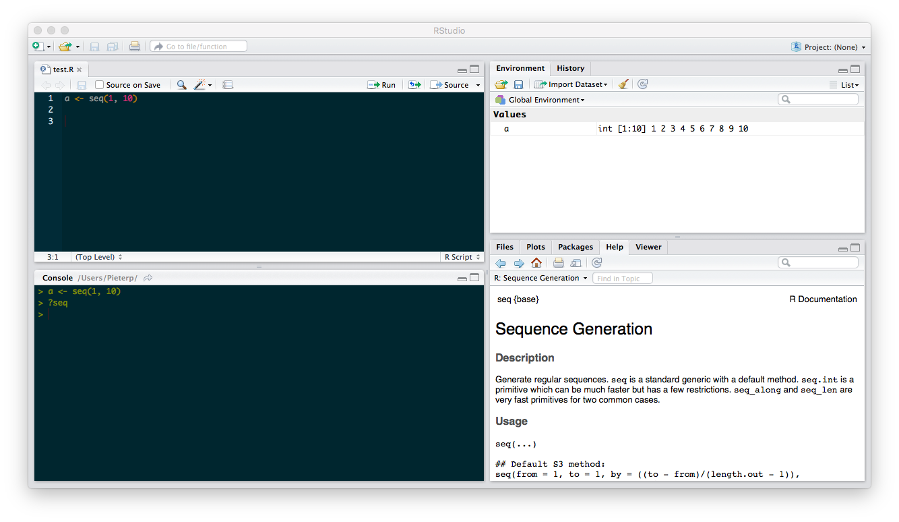

# Introduction to R (deprecated)

# Introduction to R (deprecated)

#### Contents

- [What is R](#what_is_R)
- [Installation](#installation)
  - [RStudio basics](#rstudio)  
  - [R packages](#packages)  
- [Data types](#datatypes)
  - [Vectors](#vectors)  
  - [Matrices](#matrices)  
  - [Data frames](#dataframes)  
  - [Lists](#lists)  
- [Writing and reading data](#writing-reading)
  - [Delimited text files](#delimited)  
  - [Excel files](#xlsx)  
  - [ZIP files](#zip)
  - [Shapefiles](#shapefiles)  
- [Working with data](#working-with-data)
  - [Inspecting data](#inspecting)  
  - [Manipulating data](#manipulating)
    - [Filtering](#filtering)
    - [Reordering](#reordering)
    - [Selecting and renaming columns](#selecting)
    - [Adding columns](#adding)
    - [Aggregation](#aggregation)
    - [Restructuring (matrix to long format)](#restructuring1)
    - [Restructuring (long format to matrix)](#restructuring2)
  - [Plotting](#plotting)  
  - [Mapping](#mapping)
- [Online books, courses and other resources](#online)

## What is R

R is a freely available integrated suite of software facilities for data manipulation, calculation and graphical display. It includes:

- an effective data handling and storage facility,
- a suite of operators for calculations on arrays, in particular matrices,
- a large, coherent, integrated collection of intermediate tools for data analysis, graphical facilities for data analysis and display either on-screen or on hardcopy, and
- a well-developed, simple and effective programming language which includes conditionals, loops, user-defined recursive functions and input and output facilities,
- a large number of user-created packages that extend its capabilities, available on CRAN and Github, including packages for mapping, biology and ecology.

## Installation

This manual assumes that you have R and RStudio installed on your computer.

R can be downloaded [here](http://cran.freestatistics.org/).

RStudio is an environment for developing using R. It can be downloaded [here](https://www.rstudio.com/products/rstudio/download/). You will need the Desktop version for your computer.

### RStudio basics



RStudio has four panels:

- Top left: the editor. This panel will be closed when you start RStudio. Here you can edit and execute scripts. The editor has a button to run the current line or selection, and a button to run the whole script.
- Bottom left: the console. Here you can enter commands or debug your code.
- Top right: environment and history.
- Bottom right: files, plots and help.

An R file with the code used in this introduction is available [here](https://raw.githubusercontent.com/iobis/training/master/manual/intror/intror.R).

To get help about a function, type the function name with a question mark in front:

``` r
?data.frame
```

If no documentation is found, you can try:

``` r
??data.frame
```

### R packages

R packages are reusable libraries of code. To install and load packages from the console (e.g. the ggplot2 R package), do:

``` r
install.packages("ggplot2")
library(ggplot2)
```

This only works for packages which are published on [CRAN](https://cran.r-project.org/). Nowadays packages are often published on GitHub. To install those packages, we can use the `install_github` function in the `devtools` package. Here we use the double colon syntax to automatically load the `devtools` package.

``` r
install.packages("devtools")
devtools::install_github("ropensci/rgbif")
```

Note that several packages include a vignette, which give you a tutorial style introduction to the R package. To view the vignettes of e.g. ggplot2, do:

``` r
browseVignettes(package="ggplot2")

# Directly open a vignette
vignette("ggplot2-specs")
```

## Data types

Generally, while doing programming in any programming language, you need to use various variables to store various information. The frequently used data types for storing variables are:

- [Vectors](#vectors)  
- [Matrices](#matrices)  
- [Data frames](#dataframes)  
- [Lists](#lists)  
- [Factors](#factors)

### Vectors

Vectors are the most basic data structure in R. These are ordered lists of values of a certain class such as numeric, character, or logical. Single values are vectors of length 1:

``` r
> a <- 1
> a
[1] 1
> class(a)
[1] "numeric"
> length(a)
[1] 1
```

``` r
> b <- "banana"
> b
[1] "banana"
> class(b)
[1] "character"
```

``` r
> d <- FALSE
> d
[1] FALSE
> class(d)
[1] "logical"
```

``` r
> a <- c(1, 2)
> a
[1] 1 2
```

``` r
> b <- seq(1, 10)
> b
[1]  1  2  3  4  5  6  7  8  9 10
> length(b)
[1] 10
```

An empty vector is known as `NULL` or `c()`.

### Matrices

Matrices are two-dimensional data structures. Again, all elements are of the same class.

``` r
> matrix(1:6, nrow=3, ncol=2)
     [,1] [,2]
[1,]    1    4
[2,]    2    5
[3,]    3    6
```

### Data frames

In data frames, the columns can be of different classes.

``` r
> d <- data.frame(a=c(5, 6, 7), b=c("x", "y", "z"))
> d
  a b
1 5 x
2 6 y
3 7 z
```

``` r
> d$a
[1] 5 6 7
> d[,1]
[1] 5 6 7
> d[,"a"]
[1] 1 2 3
```

``` r
> d[1]
  a
1 5
2 6
3 7
> d[,1,drop=FALSE]
  a
1 5
2 6
3 7
```

``` r
> d[1,]
  a b
1 5 x
```

The `dplyr` package has a data frame wrapper, which produces prettier output when printing:

``` r
install.packages("dplyr") # skip this if you already have 'dplyr'
library(dplyr) 
data(iris)
tbl_df(iris)
```

### Lists

A list is a collection of objects.

``` r
> a <- data.frame(a=c(1, 2, 3), b=c("x", "y", "z"))
> l <- list(a=a, b=1)
> l
$a
  a b
1 1 x
2 2 y
3 3 z

$b
[1] 1
```

Three different ways to access the second element “b”

``` r
> l$b
[1] 1
> l[[2]]
[1] 1
> l[["b"]]
[1] 1
```

## Writing and reading data

### Delimited text files

``` r
data <- data.frame(x=10:15, y=40:45) # some data
# tab separated
write.table(data, "data.txt", sep="\t", dec=".", row.names=FALSE)
data <- read.table("data.txt", header=TRUE, sep="\t", dec=".", stringsAsFactors=FALSE)
# comma , separated
write.csv(data, "data.csv", row.names=FALSE)
data <- read.csv("data.csv", stringsAsFactors=FALSE)
# dotcomma ; separated
write.csv2(data, "data2.csv", row.names=FALSE)
data <- read.csv2("data2.csv", stringsAsFactors=FALSE)
```

### Excel files

Excel files can be read and written using the xlsx and openxlsx packages. Depending on your system configuration, you may experience problems installing either of these packages (for example, xlsx has a dependency on Java). The openxlsx packages requires a recent R version.

``` r
install.packages("openxlsx")
library(openxlsx)
```

`read.xlsx()` takes two parameters: the name of the Excel file, and the sheet you want to read. The sheet can either be a name or an index, in this case `1` in order to read the first sheet.

``` r
library(openxlsx)
data <- data.frame(x = 10:15, y = 40:45) # generate some data
write.xlsx(data, "data.xlsx", sheetName = "intro", row.names = FALSE) # write to Excel
data2 <- read.xlsx("data.xlsx", 1)
data2 <- read.xlsx("data.xlsx", sheet = "intro")
```

### ZIP files

This example shows how to download a ZIP file and to read one of the files it contains:

``` r
temp <- tempfile()
download.file("http://ipt.vliz.be/eurobis/archive.do?r=nsbs&v=1.1", temp)
data <- read.table(unz(temp, "occurrence.txt"), sep="\t", header=TRUE, stringsAsFactors=FALSE)
View(data) # inspect the data
```

### Shapefiles

Shapefiles can be read using the `rgdal` package. The example below also transforms the data, so it can easily be visualized using `ggplot2`:

``` r
library(maptools)
library(rgdal)
library(ggplot2)

download.file("http://iobis.org/geoserver/OBIS/ows?service=WFS&version=1.0.0&request=GetFeature&typeName=OBIS:summaries&outputFormat=SHAPE-ZIP", destfile="summaries.zip")
unzip("summaries.zip")

shape <- readOGR("summaries.shp", layer="summaries")
shape@data$id <- rownames(shape@data)
df <- fortify(shape, region="id")
data <- merge(df, shape@data, by="id")

# plot the number of species
ggplot() +
  geom_polygon(data=data,
            aes(x=long, y=lat, group=group, fill=s),
            color='gray', size=.2) +
  scale_fill_distiller(palette = "Spectral")
```

## Working with data

### Inspecting data

``` r
library(robis)
library(dplyr)

data <- occurrence("Sargassum")

# for this example, convert back from data frame tbl (dplyr) to standard data frame
data <- as.data.frame(data)

head(data) # first 6 rows
head(data, n = 100) # first 100 rows
dim(data) # dimensions
nrow(data) # nmuber of rows
ncol(data) # number of columns
names(data) # column names
str(data) # structure of the data
summary(data) # summary of the data
View(data) # View the data

# now convert to data frame tbl (dplyr)
data <- tbl_df(data)

data
head(data)
print(data, n = 100)
```

### Manipulating data

#### Filtering

``` r
library(robis)
library(dplyr)

data <- occurrence("Sargassum")
data %>% filter(scientificName == "Sargassum muticum" & yearcollected > 2005)
```

#### Reordering

``` r
data %>% arrange(datasetName, desc(eventDate))
```

#### Selecting and renaming columns

``` r
data %>% select(scientificName, eventDate, lon=decimalLongitude, lat=decimalLatitude)
```

`select()` can be used with `distinct()` to find unique combinations of values:

``` r
data %>% select(scientificName, locality) %>% distinct()
```

#### Adding columns

``` r
data %>% tbl_df %>% mutate(zone = .bincode(minimumDepthInMeters, breaks=c(0, 20, 100))) %>% select(minimumDepthInMeters, zone) %>% filter(!is.na(zone)) %>% print(n = 100)
```

#### Aggregation

``` r
data %>% summarise(lat_mean = mean(decimalLatitude), lat_sd = sd(decimalLatitude))
data %>% group_by(scientificName) %>% summarise(records=n(), datasets=n_distinct(datasetName))
```

#### Restructuring (matrix to long format)

Biodiversity data is often provided as a site x species matrix. The reshape2 package can be used to convert these matrices to a long table format. To demonstrate this functionality, let’s load a site x species matrix which is included in the vegan package (which focuses on biodiversity data analysis).

First install and load the vegan en reshape2 packages:

``` r
install.packages("vegan")
install.packages("reshape2")
library(vegan)
library(reshape2)
```

The dataset which we will use is the BCI dataset, these are tree counts in plots on Barro Colorado Island. Load the data with `data()`:

``` r
data("BCI")
```

Each row in this matrix represents a plot. This matrix doesn’t have a column for site/plot names so let’s add that:

``` r
BCI$plot <- row.names(BCI)
```

Now use the melt function to convert from matrix to long format. Pass the following arguments: `variable.name` (this corresponds to the columns, so scientific names), `value.name` (a name for the values), and `id.vars` (the not measured variables, in this case plot).

``` r
long <- melt(BCI, variable.name = "scientificName", value.name = "count", id.vars = "plot")
```

You now have your data in the long format:

``` r
> head(long)
 plot scientificName count
1 1 Abarema.macradenia 0
2 2 Abarema.macradenia 0
3 3 Abarema.macradenia 0
4 4 Abarema.macradenia 0
5 5 Abarema.macradenia 0
6 6 Abarema.macradenia 0
```

#### Restructuring (long format to matrix)

This example converts a dataset from OBIS to a matrix format, which is more suitable for community analysis:

``` r
library(robis)
library(reshape2)

data <- occurrence(resourceid = 586)
wdata <- dcast(data, locality ~ scientificName, value.var = "individualCount", fun.aggregate = sum)
```

### Plotting

In this example, data for one species is extracted from an OBIS dataset. Density and depth are visualized using the `ggplot2` package:

``` sql
library(robis)
library(dplyr)
library(reshape2)
library(ggplot2)

data <- occurrence(resourceid = 586)

afil <- data %>% filter(scientificName == "Amphiura filiformis") %>% group_by(locality) %>% summarise(n = mean(individualCount), lon = mean(decimalLongitude), lat = mean(decimalLatitude), depth = mean(minimumDepthInMeters))

ggplot() + geom_point(data = afil, aes(lon, lat, size = n, colour = depth)) +
  scale_colour_distiller(palette = "Spectral") +
  theme(panel.background = element_blank()) + coord_fixed(ratio = 1) + scale_size(range = c(2, 12))
```

### Mapping

The `leaflet` can be used to create interactive web based maps. The example below shows the results of an outlier analysis of *Verruca stroemia* occurrences:

``` r

library(leaflet)

data <- occurrence("Verruca stroemia")

data$qcnum <- qcflags(data$qc, c(24, 28))

colors <- c("red", "orange", "green")[data$qcnum + 1]

m <- leaflet()
m <- addProviderTiles(m, "CartoDB.Positron")
m <- addCircleMarkers(m, data=data.frame(lat=data$decimalLatitude, lng=data$decimalLongitude), radius=3, weight=0, fillColor=colors, fillOpacity=0.5)
m
```

## Online books, courses and other resources

- [R Reference card](https://cran.r-project.org/doc/contrib/Short-refcard.pdf)
- [R manuals](https://cran.r-project.org/manuals.html)
- [R for cats](https://rforcats.net/)
- [Introduction to R](https://www.datacamp.com/courses/free-introduction-to-r)
- [R for Data Science](http://r4ds.had.co.nz/)
- [Advanced R](http://adv-r.had.co.nz/)
