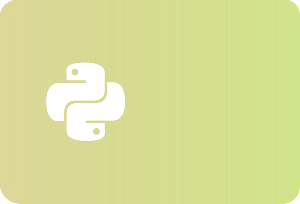

Notebooks make learning interactive — you can run code, experiment, and understand concepts as they unfold on the screen.

  

## Explore the notebooks

### 

`speciesgrids` demo

This notebook demonstrates querying the speciesgrids data product using geopandas and duckdb. The examples use the s3://obis-products/speciesgrids/h3_7/ remote datasource as default. To query a local copy instead for better performance, use the local file path.

 [ Open in GitHub](https://github.com/iobis/hackathon/blob/master/notebooks/Python/speciesgrids_demo.ipynb)

Oct 10, 2024

OBIS

### 

Removing records on land

In this short notebook we will explore how to remove records on land.

 [ Open in GitHub](https://github.com/iobis/hackathon/blob/master/notebooks/R/remove_records_on_land.ipynb)

Oct 10, 2024

OBIS

### 

Obtaining environmental information for species occurrences

In this notebook we will explore how to match environmental data to species occurrences.

[ Open in GitHub](./https:/github.com/iobis/hackathon/blob/master/notebooks/R/environmental_data_for_occurrences.qmd)

Oct 10, 2024

OBIS
