# Data visualization using R (deprecated)

# Data visualization using R (deprecated)

#### Contents

- [Introduction to the ggplot2 pckage](#ggplot)
- [Creating interactive maps using the leaflet package](#leaflet)

## Introduction to the ggplot2 package

For making static maps in R, we are going to use the ggplot2 package. First fetch some Southern sunfish occurrences from OBIS:

``` r
library(robis)
molram <- occurrence("Mola ramsayi")
```

Now create a simple scatter plot using the occurrence coordinates. Use the `ggplot()` function to initialize a new plot, and `geom_point()` to create a scatter plot. The `aes()` function is used to create a mapping (aesthetic) between our data and the visual properties, which is then passed to the `geom_point()` function. Here decimalLongitude is used as the x coordinate and decimalLatitude as the y coordinate:

``` r
library(ggplot2)
ggplot() + geom_point(data = molram, aes(x = decimalLongitude, y = decimalLatitude))
```

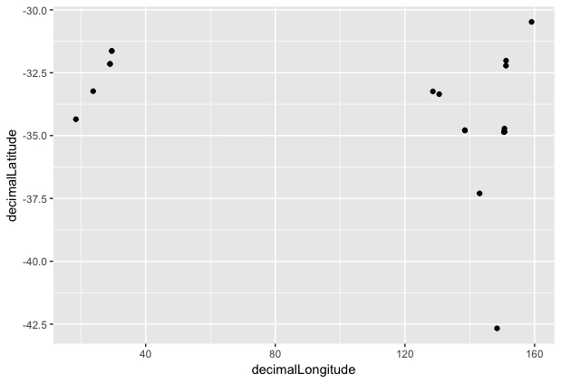

Let’s now add a world polygon to our map. ggplot2 provides a `map_data()` function to load maps of countries, continents or the entire world (this requires the maps package as well). Besides the world polygon, we also pass an aesthetic and a fill parameter to the `geom_polygon()` function.

``` r
library(maps)
world <- map_data("world")

ggplot() +
 geom_polygon(data = world, aes(x = long, y = lat, group = group), fill = "#dddddd") +
 geom_point(data = molram, aes(x = decimalLongitude, y = decimalLatitude))
```

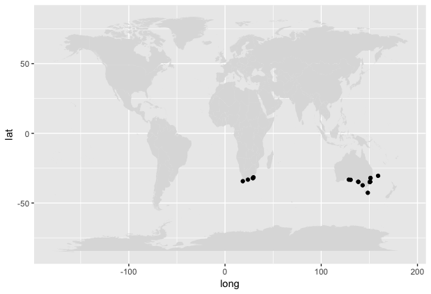

Let’s now use `coord_fixed()` to make sure the axes have the same scale. You may want to pass a different value to this function if you are mapping areas close to the poles:

``` r
ggplot() +
 geom_polygon(data = world, aes(x = long, y = lat, group = group), fill = "#dddddd") +
 geom_point(data = molram, aes(x = decimalLongitude, y = decimalLatitude)) +
 coord_fixed(1)
```

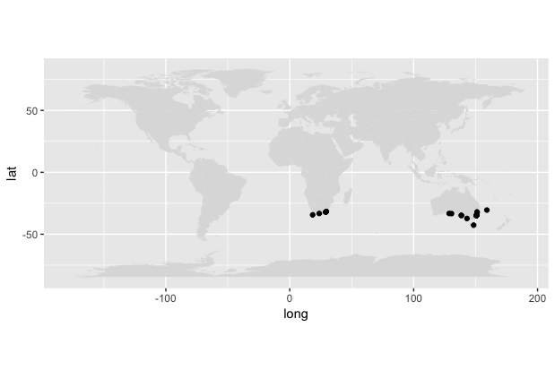

Let’s now zoom in a bit by passing `xlim` and `ylim` to `coord_fixed`:

``` r
ggplot() +
 geom_polygon(data = world, aes(x = long, y = lat, group = group), fill = "#dddddd") +
 geom_point(data = molram, aes(x = decimalLongitude, y = decimalLatitude)) +
 coord_fixed(1, xlim = c(0, 180), ylim = c(-60, 0))
```

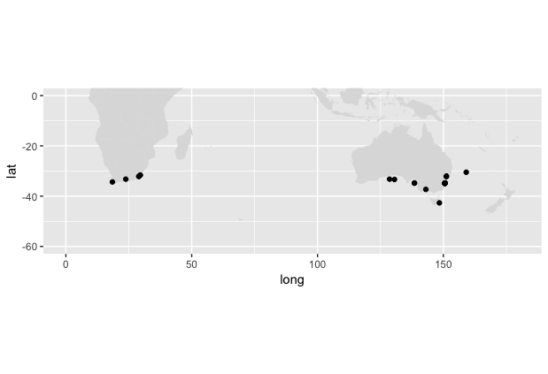

To make the plot a bit more interesting, add color to the `geom_point` aesthetic. In this example the dots are colored based on the institutionCode field of the occurrence data:

``` r
ggplot() +
 geom_polygon(data = world, aes(x = long, y = lat, group = group), fill = "#dddddd") +
 geom_point(data = molram, aes(x = decimalLongitude, y = decimalLatitude, color = datasetName)) +
 coord_fixed(1, xlim = c(0, 180), ylim = c(-60, 0))
```

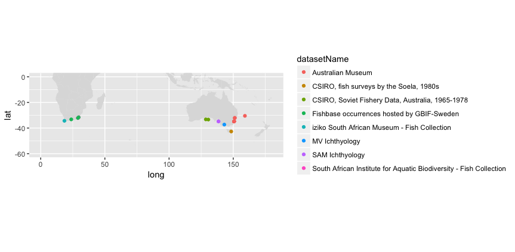

There are many ways to change color scales in ggplot, look into `scale_color_brewer()` for example:

``` r
ggplot() +
 geom_polygon(data = world, aes(x = long, y = lat, group = group), fill = "#dddddd") +
 geom_point(data = molram, aes(x = decimalLongitude, y = decimalLatitude, color = datasetName)) +
 coord_fixed(1, xlim = c(0, 180), ylim = c(-60, 0)) +
 scale_color_brewer(palette = "Paired")
```

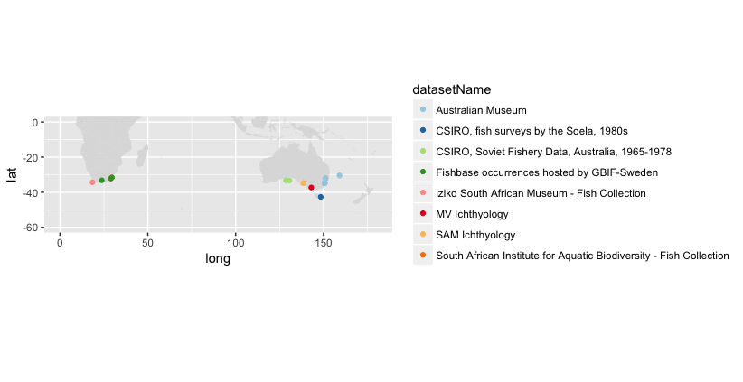

The `geom_histogram()` function can be used to create histograms. To try this, first fetch a bit more data from OBIS:

``` r
dor <- occurrence("Doridoidea")
```

Now create a simple histogram:

``` r
ggplot() +
 geom_histogram(data = dor, aes(x = yearcollected))
```

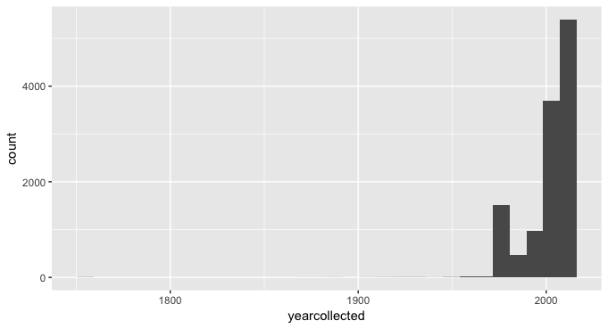

This produces a histogram, but we also get this warning message:

`stat_bin()` using `bins = 30`. Pick better value with `binwidth`. This means that by default there are 30 bins in the histogram. However, because we are displaying records per year, it makes more sense to pick a bin width ourselves, for example 2 years:

``` r
ggplot() +
 geom_histogram(data = dor, aes(x = yearcollected), binwidth = 2)
```

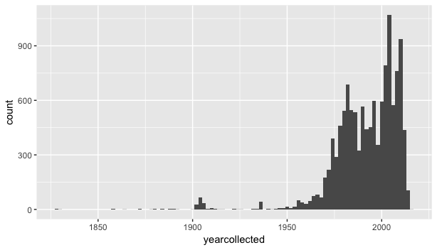

By adding fill to the aesthetic, we can color the bars based on the family:

``` r
ggplot() +
 geom_histogram(data = dor, aes(x = yearcollected, fill = family), binwidth = 2) +
 scale_fill_brewer(palette = "Spectral")
```

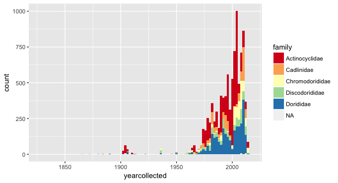

Using `xlim()` we can zoom in a bit:

``` r
ggplot() +
 geom_histogram(data = dor, aes(x = yearcollected, fill = family), binwidth = 2) +
 scale_fill_brewer(palette = "Spectral") +
 xlim(c(1950, 2017))
```

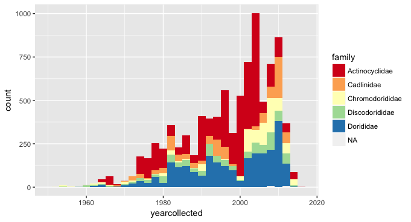

In case you need to split up your graph based on one or more factors, you can use `facet_grid()`. For example:

``` r
library(dplyr)
lag <- occurrence("Lagis")
lag_2 <- lag %>% filter(resourceID %in% c(4312, 222))

ggplot() +
 geom_histogram(data = lag_2, aes(x = yearcollected), binwidth = 2) +
 facet_grid(resourceID ~ species)
```

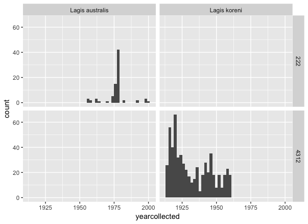

Make sure to take a look at the [R graph gallery](http://www.r-graph-gallery.com/all-graphs/) and the [ggplot extension gallery](http://www.ggplot2-exts.org/gallery/) and be inspired!

## Creating interactive maps using the leaflet package

The [leaflet](https://rstudio.github.io/leaflet/) package is a wrapper around the popular Leaflet JavaScript library for interactive maps. Install the package as follows:

``` r
install.packages("leaflet")
```

### A simple map

Initialize a map with `leaflet()` and add the default OpenStreetMap basemap using `addTiles()`:

``` r
library(leaflet)

leaflet() %>% addTiles()
```

To change the basemap, pick any of the [tile providers here](https://leaflet-extras.github.io/leaflet-providers/preview/) and pass the URL to `addTiles()`:

``` r
leaflet() %>% addTiles("https://server.arcgisonline.com/ArcGIS/rest/services/Ocean_Basemap/MapServer/tile/{z}/{y}/{x}")
```

Now fetch some data using the robis package, and add circle markers to the map using `addCircleMarkers()`. This function accepts `lng`, `lat`, as well as some styling patameters:

``` r
library(robis)
abrseg <- occurrence("Abra segmentum")

leaflet() %>%
  addTiles("https://cartodb-basemaps-{s}.global.ssl.fastly.net/light_all/{z}/{x}/{y}.png") %>%
  addCircleMarkers(lat = abrseg$decimalLatitude, lng = abrseg$decimalLongitude, radius = 3.5, weight = 0, fillOpacity = 1, fillColor = "#cc3300")
```

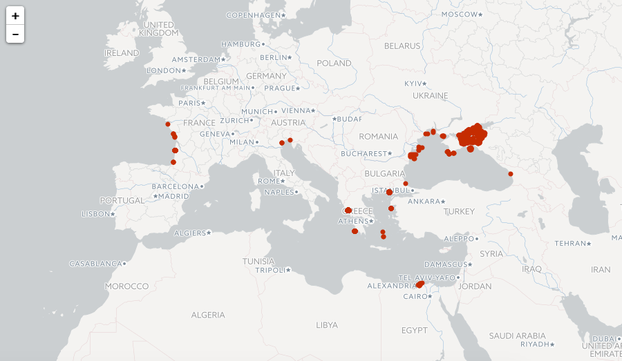

### Quality flags

The data retrieved using the R package include the [OBIS quality flags](http://www.ncbi.nlm.nih.gov/pubmed/25632106). The example below visualizes one of these flags for the European sea sturgeon. It also adds popups to the Leaflet map. Use the `qcflags()` function from the `robis` package to check for which records flag 28 is set, then use the result to create a vector of colors (red and green).

``` r
library(robis)
library(leaflet)

acistu <- occurrence("Acipenser sturio")

acistu$qcnum <- qcflags(acistu$qc, c(28))
colors <- c("#ee3300", "#86b300")[acistu$qcnum + 1]
popup <- paste0(acistu$datasetName, "<br/>", acistu$catalogNumber, "<br/><a href=\"http://www.iobis.org/explore/#/dataset/", acistu$resourceID, "\">OBIS dataset page</a>")

leaflet() %>%
  addProviderTiles("CartoDB.Positron") %>%
  addCircleMarkers(popup = popup, lat = acistu$decimalLatitude, lng = acistu$decimalLongitude, radius = 3.5, weight = 0, fillColor = colors, fillOpacity = 1)
```

[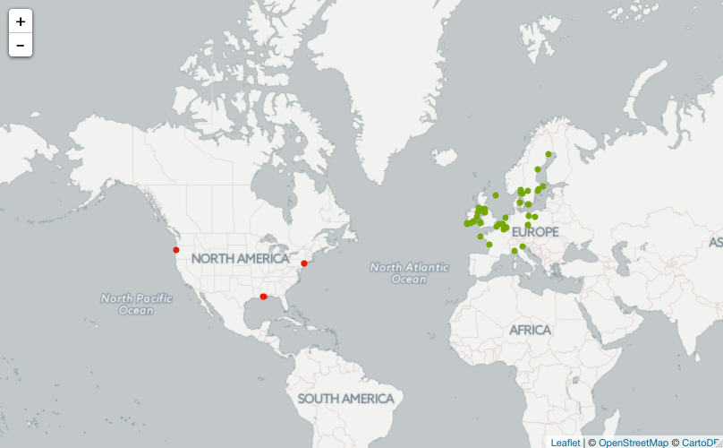](https://cdn.rawgit.com/iobis/visualizations/master/leaflet/map.html)

We cann repeat this procedure for multiple quality flags (27 and 29) as follows:

``` r
library(robis)
library(leaflet)

ices <- occurrence(resourceid = 1575, enddate = "1985-01-01")

ices$qcnum <- qcflags(ices$qc, c(27, 29))
colors <- c("#ee3300", "#ff9900", "#86b300")[ices$qcnum + 1]

leaflet() %>%
  addTiles("http://{s}.basemaps.cartocdn.com/light_nolabels/{z}/{x}/{y}.png") %>%
  addCircleMarkers(popup = ices$scientificName, lat = ices$decimalLatitude, lng = ices$decimalLongitude, radius = 3.5, weight = 0, fillColor = colors, fillOpacity = 1)
```

[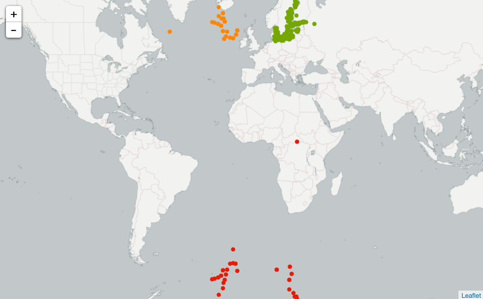](https://cdn.rawgit.com/iobis/visualizations/master/leaflet/map2.html)

### Multiple species

In the example below, data is retrieved and visualized for two cod species.

``` r
pac <- occurrence("Gadus macrocephalus")
atl <- occurrence("Gadus morhua", year = 2011)

leaflet() %>%
  addProviderTiles("CartoDB.Positron") %>%
  addCircleMarkers(lat = pac$decimalLatitude, lng = pac$decimalLongitude, radius = 3.5, weight = 0, fillOpacity = 1, fillColor = "#ff0066") %>%
  addCircleMarkers(lat = atl$decimalLatitude, lng = atl$decimalLongitude, radius = 3.5, weight = 0, fillOpacity = 1, fillColor = "#0099cc")
```

[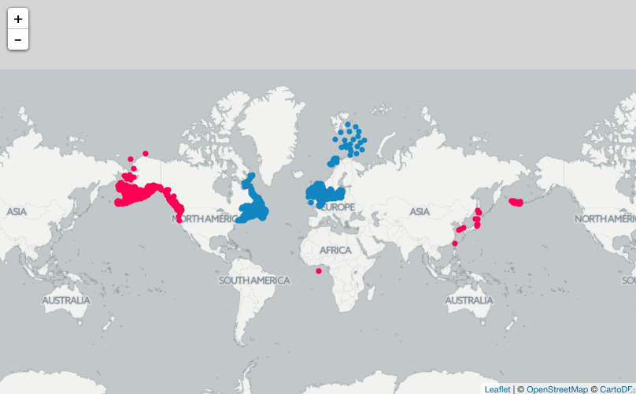](https://cdn.rawgit.com/iobis/visualizations/master/leaflet/map3.html)
