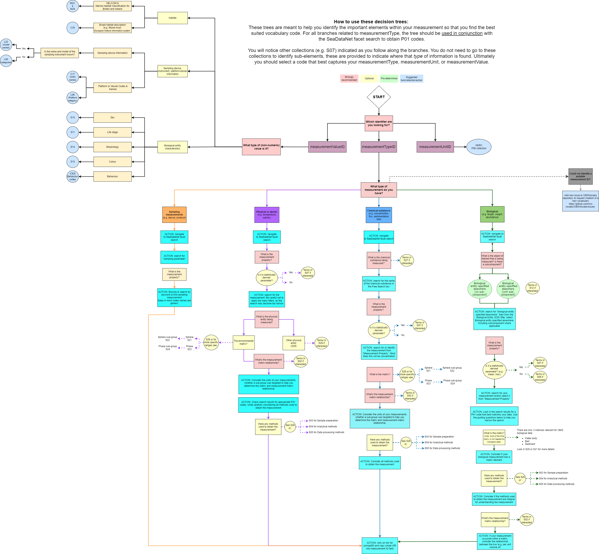

## Vocabulary Decision Tree

This decision tree was developed by the OBIS Vocabulary Team. It is meant to guide you with finding and selecting appropriate controlled vocabulary to be used in the eMoF columns `measurementTypeID`, `measurementUnitID`, and for non-numeric `measurementValueID`.

For a demonstration of how to use the tree with examples, please see the [OBIS YouTube Vocabulary series](https://www.youtube.com/playlist?list=PLlgUwSvpCFS4hADB7Slf44V1KJauEU6Ul) 

An interactive version of this tree is also in development: <https://github.com/iobis/vocab_decision_tree>.

We are happy to receive feedback on any aspect of the decision tree.

*OBIS decision tree to assist with finding and selecting appropriate controlled vocabulary used in the eMoF table.*
