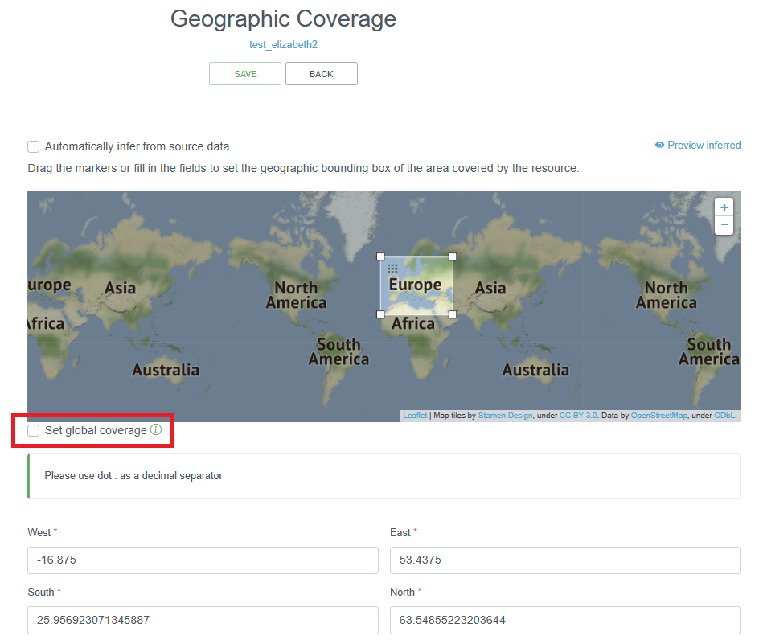
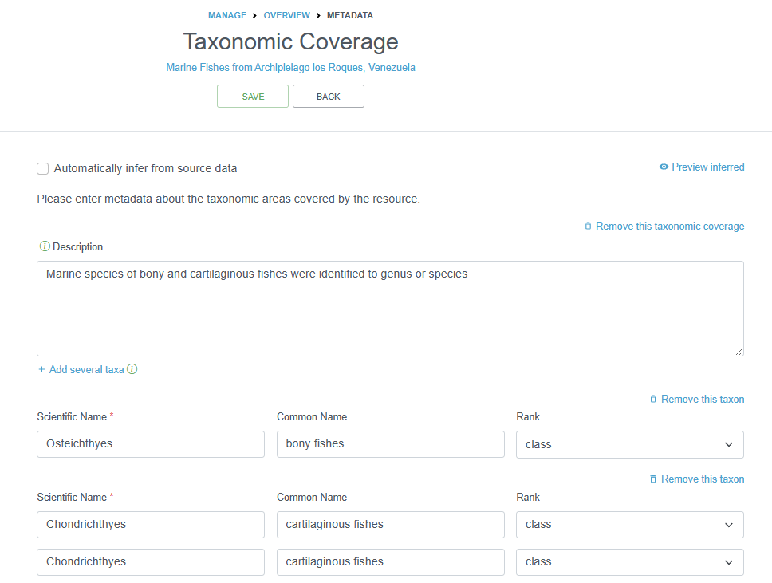
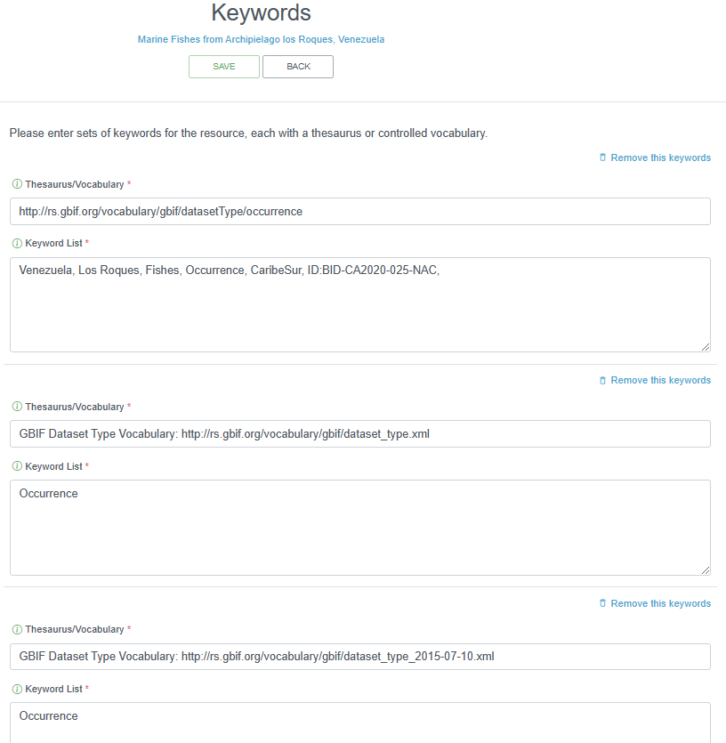
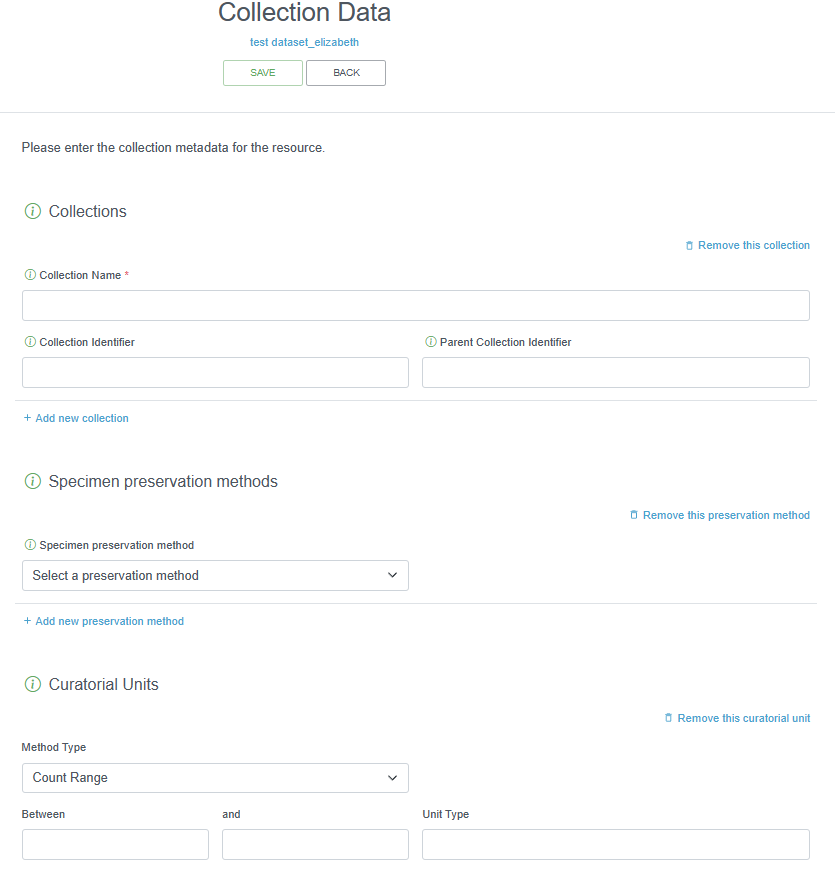

### Ecological Metadata Language

**Content**

- [Introduction](#introduction-to-eml)
- [Gudiance on specific metadata sections](#metadata-sections)
  - [Title](#title)
  - [Abstract](#abstract)
  - [People and Organizations](#people-and-organizations)
  - [License and IP Rights](#license-and-ip-rights)
  - [Coverage](#coverage) ([geographic](#geographic-coverage), [taxonomic](#taxonomic-coverage), [temporal](#temporal-coverage))
  - [Keywords](#keywords)
  - [Project](#project)
  - [Sampling methods](#sampling-methods)
  - [Citations](#citations)
  - [Bibliography](#bibliography)
  - [Collection Data](#collection-data)
  - [External Links](#external-links)

#### Introduction to EML

OBIS (and GBIF) uses the Ecological Metadata Language (EML) as its metadata standard, which is specifically developed for the earth, environmental and ecological sciences. It is based on prior work done by the Ecological Society of America and associated efforts. EML is implemented as XML. See more information on [EML](https://eml.ecoinformatics.org/). When publishing on the [Integrated Publishing Toolkit (IPT)](ipt.html), you can either upload XML files with your metadata or it will be generated for you after [filling in metadata sections](ipt.html#add-metadata) directly on the IPT. There are a few resources available to help you generate XML EML files, including: [EML R package](https://docs.ropensci.org/EML/), [ezEML](https://ezeml.edirepository.org/eml/auth/login), and [Jinja EML template generator](https://jinja.palletsprojects.com/en/3.1.x/).

OBIS uses the [GBIF EML profile (version 1.1)](http://rs.gbif.org/schema/eml-gbif-profile/1.1/eml-gbif-profile.xsd). In case data providers use ISO19115/ISO19139, there is a mapping available [here](http://rs.gbif.org/schema/eml-gbif-profile/1.1/eml2iso19139.xsl).

For OBIS, the following 4 terms are the bare minimum required: `Title`, `Citation`, `Contact` and `Abstract`. Below is an overview of all the EML terms used to describe datasets:

- `title [xml:lang="..."]`: A good descriptive `title` is indispensable and can provide the user with valuable information, making the discovery of data easier. Multiple titles may be provided, particularly when trying to express the title in more than one language (use the "xml:lang" attribute to indicate the language if not English/en).

- `creator` ; `metadataProvider` ; `associatedParty` ; `contact` : These are the people and organizations responsible for the dataset resource, either as the creator, the metadata provider, contact person or any other association. The following details can be provided:
  - `individualName`
    - `givenName`
    - `surName`
  - `organizationName`:  Name of the institution.
  - `positionName`: to be used as alternative to persons names (leave `individualName` blank and use `positionName` instead e.g. data manager).
  - `address`
    - `deliveryPoint`
    - `city`
    - `administrativeArea`
    - `postalCode`
    - `country`
  - `phone`  
  - `electronicMailAddress`
  - `onlineUrl` : personal website
  - `role`: used with `associatedParty` to indicate the role of the associated person or organization.
  - `userID`: e.g. ORCID.
    - `directory`

- `pubDate`: The date that the resource was published. Use ISO 8601.

- `language`: The language in which the resource (not the metadata document) is written. Use ISO language code.

- `abstract` : Brief description of the data resource.
  - `para`
  
- `keywordSet`
  - `keyword` : Note only one keyword per keyword field is allowed.
  - `keywordThesaurus` : e.g. ASFA
  
- `coverage`
  - `geographicCoverage`
    - `geographicDescription`: a short text description of the area. E.g. the river mounth of the Scheldt Estuary.
    - `boundingCoordinates`
      - `westBoundingCoordinate`
      - `eastBoundingCoordinate`
      - `northBoundingCoordinate`
      - `southBoundingCoordinate`
  - `temporalCoverage` : Use ISO 8601
    - `singleDateTime`
    - `rangeOfDates`
      - `beginDate`
        - `calendarDate`
      - `endDate`
        - `calendarDate`
  - `taxonomicCoverage`: taxonomic information about the dataset. It can include a species list.
    - `generalTaxonomicCoverage`
    - `taxonomicClassification`
      - `taxonRankName`
      - `taxonRankValue`
      - `commonName`

- `intellectualRights`: Statement about IPR, Copyright or various Property Rights. Also read the [guidelines on the sharing and use of data in OBIS](policy.html).
  - `para`
- `purpose`: A description of the purpose of this dataset.
  - `para`

- `methods`
  - `methodStep`: Descriptions of procedures, relevant literature, software, instrumentation, source data and any quality control measures taken.
  - `sampling`: Description of sampling procedures including the geographic, temporal and taxonomic coverage of the study.
  - `studyExtent`: Description of the specific sampling area, the sampling frequency (temporal boundaries, frequency of occurrence), and groups of living organisms sampled (taxonomic coverage).
  - `samplingDescription`: Description of sampling procedures, similar to the one found in the methods section of a journal article.
    - `para`
  - `qualityControl`: Description of actions taken to either control or assess the quality of data resulting from the associated method step.
  
- `project`
  - `title`
  - `identifier`
  - `personnel`: The personnel field is used to document people involved in a research project by providing contact information and their role in the project.
  - `description`
  - `funding`: The funding field is used to provide information about funding sources for the project such as: grant and contract numbers; names and addresses of funding sources.
    - `para`
  - `studyAreaDescription`
  - `designDescription`: The description of research design.
  
- `maintenance`
  - `description`
    - `para`
  - `maintenanceUpdateFrequency`
  
- `additionalMetadata`
  - `metadata`
    - `dateStamp`: The dateTime the metadata document was created or modified (ISO 8601).
    - `metadataLanguage`: The language in which the metadata document (as opposed to the resource being described by the metadata) is written
    - `hierarchyLevel`
      - `citation` : A single citation for use when citing the dataset. The IPT can also auto-generate a citation based on the metadata (people, title, organization, onlineURL, DOI etc).
      - `bibliography`: A list of citations that form a bibliography on literature related / used in the dataset
      - `resourceLogoUrl`: URL of the logo associated with a dataset.
      - `parentCollectionIdentifier`
      - `collectionIdentifier`
      - `formationPeriod`: Text description of the time period during which the collection was assembled. E.g., "Victorian", or "1922 - 1932", or "c. 1750".
      - `livingTimePeriod`: Time period during which biological material was alive (for palaeontological collections).
      - `specimenPreservationMethod`
      - `physical`
        - `objectName`
        - `characterEncoding`
        - `dataFormat`
          - `externallyDefinedFormat`
          - `formatName`
        - `distribution`: URL links
          - `online`
            - `url function="download"`
            - `url function="information"`

- `alternateIdentifier`: It is a Universally Unique Identifier (UUID) for the EML document and not for the dataset. This term is optional.

#### Metadata Sections

There are several categories/pages for metadata you must provide, which includes basic information about the:

- Dataset and data provider
- Geographic/taxonomic/temporal coverage
- Keywords
- Hosting institution information
- Information regarding associated project(s)
- Sampling methods
- How to cite the dataset
- Museum collection (if applicable)
- Other external links (e.g. a homepage) or additional metadata

We review each of these sections below.

##### Title

The IPT requires you to provide a _Shortname_. Shortnames serve as an identifier for the resource within the IPT installation (so should be unique within your IPT), and will be used as a parameter in the URL to access the resource via the Internet. Please use only alphanumeric characters, hyphens, or underscores. E.g. _largenet_im_ in [http://ipt.vliz.be/eurobis/resource?r=largenet_im](http://ipt.vliz.be/eurobis/resource?r=largenet_im). After creating a new dataset resource, the field title will be filled out with the short name you provided earlier. Please make sure you provide a dataset title following the guidelines below.

Dataset titles provided to OBIS node managers are often very cryptic, such as an acronym, and often only understandable by the data provider. However, to increase the discoverability and be useful for a larger audience, the dataset title should be as descriptive and complete as possible. OBIS recommends titles to contain information about the taxonomic, geographic and temporal coverage. If the dataset title does not meet these criteria and you believe the title should be changed, then contact the data provider with a suggestion or ask for a more descriptive title. If the dataset has already been published (made publicly available) - and therefore known by that title elsewhere, then the same title should be kept (even if it would not meet the proposed guidelines)! Changing the title of an already published dataset cannot be done, as this will generate confusion and possible duplicates in systems like OBIS or GBIF in a later stage.

The acronym or working title could still be documented in the metadata, so there is no confusion about how the full title is linked to the originally provided acronym or working title.

> **Caution:** Always consult the data provider when changing a dataset title to a more workable and descriptive version.

|Originally received title |    Title Recommended by Node Manager|
|------------------------- |    ---------------------------------|
|BIOCEAN               |        BIOCEAN database on deep sea benthic fauna|
|Biomôr                 |       Benthic data from the Southern Irish Sea from 1989-1991|
|Kyklades              |        Zoobenthos of the Kyklades (Aegean Sea)|
|REPHY                |         Réseau de Surveillance phytoplanctonique|

##### Abstract

The abstract or description of a dataset provides basic information on the content of the dataset. The information in the abstract should improve understanding and interpretation of the data. It is recommended that the description indicates whether the dataset is a subset of a larger dataset and – if so – provide a link to the parent metadata and/or dataset.

If the data provider or OBIS node require bi- or multilingual entries for the description (e.g. due to national obligations) then the following procedure can be followed:

- Indicate English as metadata language
- Enter the English description first
- Type a slash (/)
- Enter the description in the second language

_Example:_ The Louis-Marie herbarium grants a priority to the Arctic-alpine, subarctic and boreal species from the province of Quebec and the northern hemisphere. This dataset is mainly populated with specimens from the province of Quebec. /  L'Herbier Louis-Marie accorde une priorité aux espèces arctiques-alpines, subarctiques et boréales du Québec, du Canada et de l'hémisphère nord. Ce jeu présente principalement des spécimens provenant du Québec.

##### People and Organizations

The EML has several possible roles/functions to describe a contact, creator, metadata provider and associated party.

The `contact` is the person or organization that curates the resource and who should be contacted to get more information or to whom questions with the resource or data should be addressed. Although a number of fields are not required, we strongly recommend providing as much information as possible, and in particular the email address. This will also be the contact information that appears on the OBIS metadata pages.

The `creator` is the person or organization responsible for the original creation of the resource content. When there are multiple creators, the one that bears the greatest responsibility is the resource creator, and other people can be added as associated parties with a role such as ‘originator’, ‘content provider’, 'principal investigator', etc.

Possible functions/roles:

- Originator (person/organization that originally gathered/prepared the dataset)
- Content provider (principal person/organization that contributed content to the dataset)

If the resource contact and the resource creator are identical, the IPT allows you to easily copy the information.

The `metadata provider` is the person or organization responsible for producing the resource metadata. If the metadata are provided by the original data provider, then his/her contact details should be filled in. If no metadata are available (e.g. for historical datasets, with no contact person), then the metadata can be completed by e.g. the OBIS node manager and the OBIS node manager becomes the metadata provider.

The `Associated Parties` contains information about one or more people or organizations associated with the resource in addition to those already covered on the IPT Basic Metadata page. For example, if there would be multiple contact persons or metadata creators, they can be added in this IPT section. The principal contact/creator should, however, be added in the IPT Basic Metadata section, not the `Associated Parties` section. It is recommended to complete this section together with the IPT Basic Metadata page, to avoid confusion or overlap in added information.

Possible functions/roles for associated parties are:

- Custodian steward (person/organization responsible for/takes care of the dataset paper)
- Owner (person/organization that owns the data – may or may not be the custodian)
- Point of contact (person/organization to contact for further information on the dataset)
- principal investigator (primary scientific contact associated with the dataset)

_Notes:_

The owner of a dataset will, in most cases, be an institute, and not an individual person. Although the fields ‘last name’, and ‘position’ are indicated as mandatory fields, it is possible to just add the institute name in the 'last name' field for the role ‘owner’.

The contact persons in the metadata (contact, creator, metadata creator) are used in the dataset citation (auto-generation) and those added as 'associated parties' are not included as "co-authors".

##### License and IP Rights

OBIS has published its guidelines on the sharing and use of data [here](policy.html). The recommended licenses for datasets published in OBIS are the Creative Commons Licenses (CC-0, CC-BY, CC-BY-NC), of which CC-0 is the most preferred and CC-BY-NC is least preferred. A Creative Commons license means:

- You are free:
  - to share => to copy, distribute and use the database
  - to create => to produce works from the database
  - to adapt => to modify, transform and build upon the database

**In case of CC-0:**
`public domain`: CC-0 is the preferred option identified by the OBIS steering group. You waive any copyright you might have over the data(set) and dedicate it to the public domain. You cannot be held liable for any (mis)use of the data either. Although CC-0 doesn’t legally require users of the data to cite the source, it does not take away the moral responsibility to give attribution, as is common in scientific research. A good blog on why using CC-0 can be found [here](https://community.canadensys.net/2012/why-we-should-publish-our-data-under-cc0).

**In case of CC-BY:**
`Attribution`: You must attribute any public use of the database, or works produced from the database, in the manner specified in the license. For any use or redistribution of the database, or works produced from it, you must make clear to others the license of the database and keep intact any notices on the original database.

**In case of CC-BY-NC:**
`non-commercial`: like CC-BY but commercial use is not allowed. This licence can be problematic when the data is re-used in scientific journals.

##### Coverage

###### Geographic Coverage

The IPT allows you to enter the geographic coverage by dragging the markers on the given map or by filling in the coordinates of the bounding box. In the description field, a more elaborate text can be provided to describe the spatial coverage indicating the larger geographical area where the samples were collected. For the latter, the sampling locations can be plotted on a map and – by making use of a Gazetteer – the wider geographical area can be derived: e.g. the relevant Exclusive Economic Zone (EEZ), IHO, FAO fishing area, Large Marine Ecosystem (LME), Marine Ecoregions of the World (MEOW), etc. The [Marine Regions' Gazetteer](http://www.marineregions.org/) might prove to be a useful online tool to define the most relevant sea area(s). There are also [LifeWatch Geographical Services](http://www.lifewatch.be/data-services/) that translate geographical positions to these wider geographical areas.

The information given in this section can also help the OBIS node manager in geographic quality control. If the geographic coverage in the EML e.g. is "North Sea", but a number of data points are outside of this scope, then this may indicate  errors, and should be checked with the data provider.

If the dataset covers multiple areas (e.g. samples from the North Sea and the Mediterranean Sea), then this should clearly be mentioned in the `geographicDescription` field. Note that the IPT only allows one bounding box, and you have to uncheck the “Set global coverage” box to change box bounds.

{width=60%}

###### Taxonomic Coverage

This section can capture two things:

1. A description of the range of taxa that are addressed in the data set. OBIS recommends to only add the higher classification (Kingdom, Class or Order) of the involved groups (e.g. Bivalvia, Cetacea, Aves, Ophiuroidea…). You can easily draw a list of higher taxonomic ranks from the WoRMS taxon match service (or ask the data provider). The taxonomic coverage is not a mandatory field, but the information stored here can be very useful as background information. The description can also contain common names, such as e.g. benthic foraminifera or mussels.
2. An overview of all the involved taxa (not recommended, as all the taxa are already listed in the dataset).

`r fontawesome::fa("flag", fill="darkblue", prefer_type="solid")` OBIS also recommends to add information on the (higher) taxonomic groups in the (descriptive) dataset title and abstract.

{width=70%}

###### Temporal Coverage

The temporal coverage will be a date range, which can easily be documented. If it is a single date, the start and end date will be the same. The information added here can be used as a quality check for the actual dates in the datasets.

You can also document the Formation Period or the Living Time Period in this section for specimens that may not have been alive during the collection period, or to indicate the time during which the collection occurred.

{width=70%}

##### Keywords

Relevant keywords facilitate the discovery of a dataset. An indication of the represented functional groups can help in a general search (e.g. plankton, benthos, zooplankton, phytoplankton, macrobenthos, meiobenthos …). Assigned keywords can be related to taxonomy, habitat, geography or relevant keywords extracted from thesauri such as the [ASFA thesaurus](https://vocabularyserver.com/asfa/), the [CAB thesaurus](http://www.cabi.org/cabthesaurus/) or [GCMD keywords](https://www.earthdata.nasa.gov/learn/find-data/idn/gcmd-keywords).

As taxonomy and geography are already covered in previous sections, there is no need to repeat related keywords here. Please consult your data provider which (relevant) keywords can be assigned.

{width=70%}

##### Project

If the dataset in this resource is produced under a certain project, the metadata on this project can be documented here.
Part of the information entered here, can partly overlap with information given in other sections of the metadata (e.g. study area description can have lot of parallel with the geographic coverage section). Personnel involved in the project can be documented or repeated here as well. This is not a problem.

##### Sampling Methods

The EML can contain descriptions of the sampling and data processing methods. Study extent can be documented here as well to report a more specific geographic area as well as the sampling frequency. Descriptions of sampling procedures, quality control, and steps (sample or data processing) can be given in the same way as the methods section of a scientific paper.

`r fontawesome::fa("flag", fill="darkblue", prefer_type="solid")` OBIS best practice is to add sampling facts to the extended MeasurementorFact extension, linked to the sampling events in the Event core via eventID.

##### Citations

The dataset citation allows users to properly cite your dataset in further publications or other uses of the data. When users download datasets from the OBIS download function, a list of the dataset citations packaged with the data in a zipped file is provided.

A dataset citation is different from the data source citation (in case the data is digitized from a publication), and these references can be added to the additional metadata (see bibliography below). A dataset citation can have the same format of a journal article citation, and should include the authors (contact, creator, principle investigator, data managers, custodians, collectors…), the title of the dataset, the name of the data publisher (or custodian institute), and the access point URL to the resource.

GBIF's IPT has an auto-generation - Turn On/Off - tool to let the IPT auto-generate the resource citation for you. The citation includes a version number, which is especially important for datasets that are continuously updated. The dataset citation can also include a Citation Identifier - a DOI, URI, or other persistent identifier that resolves to an online dataset web page.

The OBIS node data managers should try to implement a certain degree of format standardization for the dataset citations. The IPT provides an option to auto-generate a citation based on the EML and is formatted as follows: {dataset.authors} ({dataset.pubDate}) {dataset.title}. [Version {dataset.version}]. {organization.title}.
{dataset.type} Dataset {dataset.doi}, {dataset.url}

##### Bibliography  

The EML can include the citation of the publications that are related to the described dataset. They can describe the dataset, be based on the dataset or be used in this dataset. Publications can be scientific papers, reports, PhD or master theses. If available, the citation should include the DOI at the end.

This overview will contribute to a better understanding of the data as these publications can hold important additional information on the data and how they were acquired.

##### Collection Data

This IPT section should only be filled out if there are specimens held in a museum.
If relevant, it is strongly recommended that this information is supplied by the data provider or left blank. The collection name, specimen preservation method, and curatorial units should be provided, as applicable.

{width=70%}

##### External Links

This section can include URLs to the resource homepage, to download or find additional information. You can also provide links to your resource if it is hosted elsewhere in different formats.

Links to the online dataset on the OBIS website can be added once the data is available there.
For these OBIS links, the required fields should be completed as follows:

- Name: online dataset
- Character set: UTF-8
- Data format: html

If other links are added, then the data format for web-based data is ‘html’. If the link refers to a file, the data format of the file will need to be added (e.g. .xlsx, .pdf …). The character set for all Darwin Core files is UTF-8, whereas for other web pages this can vary, so you may need to confirm.

##### Additional Metadata

Any remaining information that could not be catalogued under any of the other metadata, can be mentioned here. This may include logos, purpose of the dataset, a description of how the dataset will be maintained, etc.
