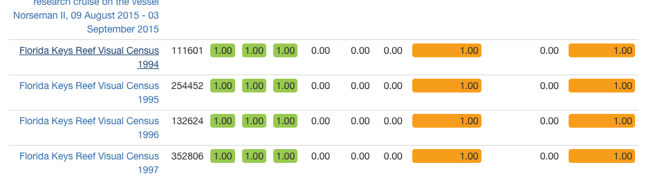
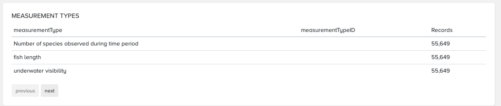
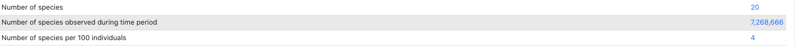
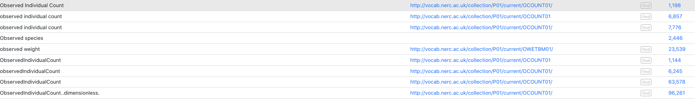
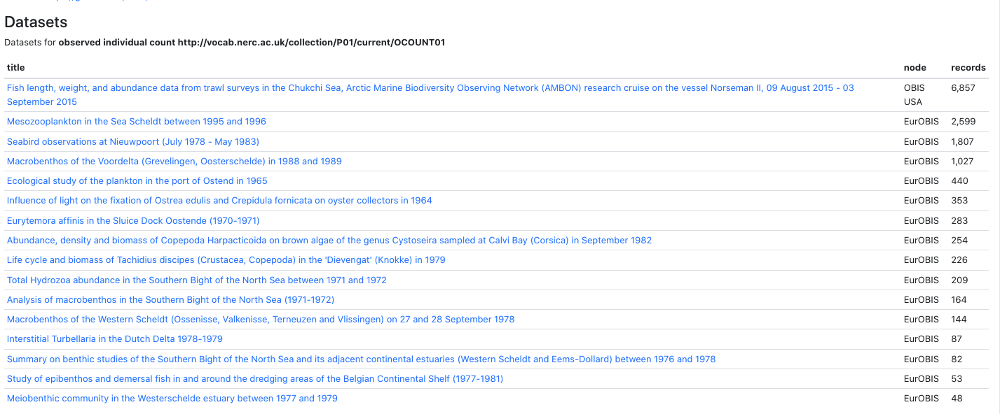

## How To Use MoF Report and Tool

A MEASUREMENT TYPES dataset report has been added regarding currently used measurementType and associated measurementTypeID(s), located near the bottom of the individual dataset pages (if measurementType in use for the dataset).

This new dataset report was derived from this MoF statistics report <https://r.obis.org/mof/"> and this active filtering MoF tool <https://mof.obis.org/>.

To more easily locate the datasets within your node that may have possible measurementType ID issues, use the MoF Statistics page: <https://r.obis.org/mof/>.  This contains the list of Nodes currently using measurementType/measurementValue/measurementUnit with counts and percentage missing for the associated ID(s).

If there is a node in that list that you are interested in locating, searching for and possibly fixing MoF issues, select the Node from the list, then select a dataset (displaying a high percentage of missing ID(s)), and scroll down to the MEASUREMENT TYPE report

Example, selected OBIS USA,

then selected Florida Keys Reef Visual Census 1994, and scrolled down to MEASUREMENT TYPES section:

To locate other datasets using these MEASUREMENT TYPES, use this active filtering MoF tool <https://mof.obis.org>, sort by measurementType (click column header) and scroll to measurementType(s) of interest

For MEASUREMENT TYPE “Number of species observed during time period” has only one entry, which is missing associated ID.  To see which datasets are using the listed measurementType, measurementTypeID combination, click on the number of records which is the last column.

All are from OBIS USA.

For MEASUREMENT TYPE “fish length” …  To see which datasets are using this also listed measurementType, measurementTypeID combination, click on the number of records which is the last column.

There are two records for fish length, one missing an ID and the other using S06, which may not be the preferred ID for this measurementType:

Also, while scrolling through this report,  you may notice something you would like to further research, click the record count value to see a list of datasets and associated node(s) using this noted type/ID.  NOTE: Current USE does not indicate CORRECT use:

To see BODC label for the provided ID, click the Find button, second last column:

This is showing a different label from the (variety of) measurementType provided.

To see which datasets are using a specific measurementType / ID combination, click the records count, last column:

Things you are looking to clean up:

- If measurementTypeID is empty this should be updated.
- If the same measurementType (with same meaning/purpose) is using multiple measurementTypeIDs, these should be fixed to a single, preferred BODC vocab value.
