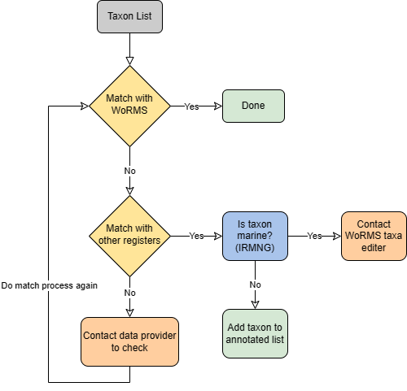

## Name Matching Strategy for taxonomic quality control 

OBIS requires all your species names to be matched against an authoritative taxonomic register. This effectively attaches stable identifiers to each of your species. Meaning, if a taxonomic ranking or a species name changes in the future, there will be no question as to which species your dataset is actually referring to.

OBIS currently accepts identifiers from **three** authoritative lists:

* [World Register Marine Species (WoRMS)](https://www.marinespecies.org/) LSIDs
* [Integrated Taxonomic Information System (ITIS)](https://www.itis.gov/) TSNs
* [Barcode of Life Data Systems (BOLD)](https://biodiversitygenomics.net/projects/bold/) and [NCBI](https://www.ncbi.nlm.nih.gov/) identifiers

The identifiers (LSID, TSN, ID) from these registers will be used to populate the `scientificNameID` field. If you would like to include multiple identifiers, please use a concatenated list where each register is clearly identified (e.g. urn:lsid:itis.gov:itis_tsn:12345, NCBI:12345, BOLD:12345).

> **Note**
> You should prioritize using LSIDs because they are unique identifiers which indicate the authority the ID comes from.

You can also use the [Interim Register of Marine and Nonmarine Genera (IRMNG)](https://www.irmng.org/aphia.php?p=search) to [distinguish marine genera from freshwater genera](common_qc#non-marine-species.html).

### Taxon Matching Workflow

The OBIS node managers have agreed to match all the scientific names in their datasets according to the following Name Matching workflow:

{width=40%}

#### Step 1: Match with WoRMS

The procedure for matching to WoRMS and then attaching successful matches back to your data can be simplified to:

* Prepare list of your species
* Upload to WoRMS taxon match tool
  * Check relevant boxes
* Review returned file
* Identify data to include for OBIS
  * LSIDs, taxonomic fields, etc.
* Attach LSIDs back to your data using either:
  * R (merge)
  * Excel (vlookup)

The taxon match tool of the World Register of Marine Species (WoRMS) is available at [http://www.marinespecies.org/aphia.php?p=match](http://www.marinespecies.org/aphia.php?p=match). The WoRMS taxon match will compare your taxon list to the taxa available in WoRMS.

This taxon match takes into account exact matches and fuzzy matches. Fuzzy matches include possible spelling variations of a name available in WoRMS. WoRMS also identifies ambiguous matches, indicating that several potential matching options are available (e.g. homonyms). You can check these ambiguous matches and select the correct one, based on e.g., the general group information (a sponge dataset) or the authority. If this would be impossible with the available information (e.g., missing authority or very diverse dataset), then you need to contact the data provider for clarification.

For performance reasons, the limit is set to 1,500 rows for the taxon match tool. Larger files can be sent to [info@marinespecies.org](mailto:info@marinespecies.org) and will be returned as quickly as possible.

After matching, the tool will return you a file with the AphiaIDs, LSIDs, valid names, authorities, classification, and any other output you have selected.

> **Note**
> The WoRMS LSID is used for `DwC:scientificNameID`.

A complete online manual is available at [http://www.marinespecies.org/tutorial/taxonmatch.php](http://www.marinespecies.org/tutorial/taxonmatch.php). We have also created a [video tutorial] for using the taxon match tool, including how to attach the IDs back to your own data using Excel’s vlookup function. R script to do this is shown below.

**R script for attaching Taxon Lists to ID Lists:**

If you are familiar enough with R, you can use the [`merge`](https://www.rdocumentation.org/packages/base/versions/3.6.2/topics/merge) function to attach the two lists to your data. We provide a short example of how to use this function below.

```R
#Generate example data table with species occurences, for this example we will only have one column with the scientificName
data<-data.frame(scientificName=c("Thunnus thynnus", "Rhincodon typus", "Luidia maculata","Ginglymostoma cirratum"))

# this would be your matched file from WoRMS, but for example we are generating a simple list with the species names and LSIDs
lsids<- data.frame(scientificName=c("Ginglymostoma cirratum","Luidia maculata","Thunnus thynnus", "Rhincodon typus"),
 LSID = c("urn:lsid:marinespecies.org:taxname:105846", "urn:lsid:marinespecies.org:taxname:213112","urn:lsid:marinespecies.org:taxname:127029","urn:lsid:marinespecies.org:taxname:105847"))

#merge data frames together
matched_data<-merge(data, lsids, by = "scientificName")
matched_data
```

#### Step 2: Match with other registers

If you do not find a match with WoRMS, you should next check other registers. The [LifeWatch taxon match](http://www.lifewatch.be/data-services/) compares your taxon list to multiple taxonomic standards. Matching with multiple registers gives an indication of the correct spelling of a name, regardless of its environment. If a name would not appear in any of the registers, this could indicate a mistake in the scientific name and the name should go back to the provider for additional checking/verification.

Contrary to the WoRMS taxon match, when several matching options are available, the LifeWatch taxon match only mentions “no exact match found, multiple possibilities” instead of listing the available options. If multiple options are available, these should be looked up and matched manually.

Currently, this web service matches the scientific names with the following taxonomic registers:

* World Register of Marine Species – WoRMS
* Catalogue of Life – CoL
* Integrated Taxonomic Information System – ITIS
* Pan-European Species-directories Infrastructure – PESI
* Index Fungorum – IF
* International Plant Names Index – IPNI
* Global Names Index - GNI
* Paleobiology Database - PaleoDB

#### Step 3: Is taxon marine?

The Interim Register of Marine and Non-marine Genera (IRMNG) matching services are available through [http://www.irmng.org/](http://www.irmng.org/), as well as through the [LifeWatch taxon match](http://www.lifewatch.be/data-services/). This service allows you to search for a genus (or other taxonomic rank when you unchcek the “genera” box) to check if it is known to be marine, brackish, freshwater, or terrestrial. You can find this information in the row labeled “Environment”. If the taxa is marine, you may have to contact

### R packages for taxon matching

If you are familiar with R, you may use the [obistools](https://github.com/iobis/obistools#taxon-matching) function `match_taxa` to conduct taxon matching for your dataset. There is also a WoRMS package called [worrms](https://cran.r-project.org/web/packages/worrms/index.html) that has a function called `wm_records_taxamatch` you can use to conduct taxon matching.

The output will be the same as that from the WoRMS tool, so you should check ambiguous matches as described above, confirming with other registers as necessary.

### Taxon Match Tools Overview

See the table below for a summary of the different tools available.

| Tool | Advantage | Disadvantage |
|-----------|---------------------|-----------------|
|WoRMS taxon match | Accessible online, Does not require coding knowledge | Requires rematch information back to your data |
|obistools::match_taxa | Produces same output as WoRMS taxon match, Already in R so easier to merge back with data | Requires knowledge of R or python |
|worrms::wm_records_taxamatch | Outputs all WoRMS matching information | Outputs a tibble for each taxa name specified, Requires knowledge of R or python |

#### How to fetch a full classification for a list of species from WoRMS?

When setting up your WoRMS taxon match, to obtain the full classification for your list of species, simply check the box labeled “Classification”. This will add classification output in addition to the requested identifiers to your taxon match file, including Kingdom, Phylum, Class, Order, Family, Genus, Subgenus, Species, and Subspecies.

{width=70%}

#### What to do with non-matching names?

If your scientificName does not find an exact match to the WoRMS database, you may get an  **ambiguous** match. According to WoRMS guidelines, ambiguous matches can be marked as one of the following :

* phonetic
* near_1
* near_2
* near_3
* match_quarantine
* match_deleted

See <https://www.marinespecies.org/tutorial_taxonmatch.php> for definitions of each of these terms.

In each of these cases, WoRMS will try to suggest a species to match your uncertain taxon. Take care to ensure the correct species name is selected. This is especially true for near_2 or near_3 matches. When checking a potential matched name, we recommend referencing the authority and higher taxonomic levels of a given suggestion. For example, if you know the ambiguous species is a sponge, but one of the suggestions is for a mammal, you know that is not the correct name.

{width=70%}

In cases where no match can be found, WoRMS will indicate none. For these cases you should follow these steps:

* First ensure the name was entered correctly and any other information (e.g., authority, year, identification qualifiers) are included in separate columns, not the same cell as the name.
* Match with [LifeWatch](https://www.lifewatch.be/data-services/)
* Check that the species [is marine](common_qc#non-marine-species.html)

If a scientific name does not appear in any register, you should contact the original data provider, where possible, to confirm taxonomic spelling, authority, and obtain any original description documents, then attempt to match again. If even after this there are no matches, you should contact info@marinespecies.org to see if the taxon should be added to the WoRMS register.
