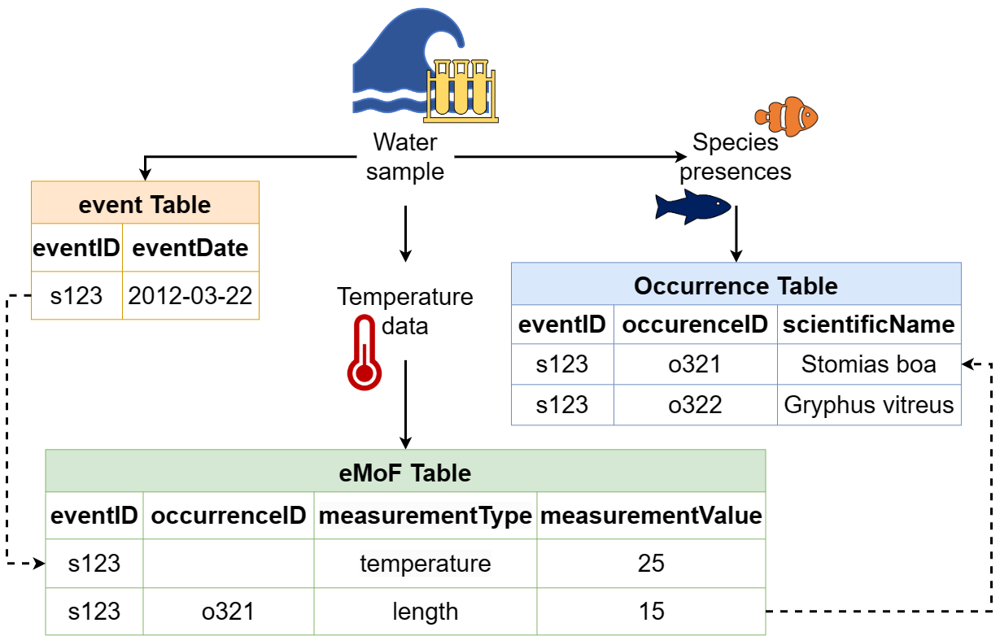

#### Relational databases: the underlying framework of OBIS

If you are not familiar with relational databases, it can be difficult to understand the underlying framework OBIS relies on. This section will help you understand relational databases, how they relate to OBIS, the data you will format for OBIS, and the data you may download from OBIS. 

Why do we use relational databases in the first place? You are probably familiar with flat databases which contain all data in one table - this is likely how your own data are formatted. Relational databases instead consist of multiple data tables that each contain _related_ information. When all this information is presented in one table, the table becomes larger, very complicated, and the likelihood of data duplication increases. Relational databases seek to simplify complexities and [reduce redundancy](relational_db.html#how-to-avoid-redundancy) by allowing information to be self-contained, but linked to each other.

You can think of a relational database as separate Excel sheets or data tables that are related to each other. One data table could be a “core” table, whereas others are “extensions”. Sometimes the relationships between core and extension tables are hierarchical, but this is not always the case. There is, however, always a _relationship_ linking core and extension tables. 

Let's review core and extension tables and how we use them for OBIS.

Core tables contain information that is applicable to **all** extension tables, and extension tables contain more information about the records within the Core table. Each table, whether core or extension, contains records and attributes. Each row is a record (e.g., a sampling event, a species’ occurrence), whereas each column is an attribute (e.g., a date, a measurement). 

Records between tables are linked to each other by the use of _identifiers_. A description of measurements pertaining to a record in an Extension table will have the same identifier as the record it is describing in the Core table. By using identifiers to link records, we reduce data repetition, see [below](relational_db.html#how-to-avoid-redundancy) for examples. In the Darwin Core format that OBIS uses, the core table is either [Event](https://manual.obis.org/data_format.html#when-to-use-event-core) or [Occurrence](https://manual.obis.org/data_format.html#when-to-use-occurrence-core), and datasets can have [one, none, or more](formatting.html#extensions-accepted-by-OBIS) extension tables. Further explanation of data formatting in OBIS is covered in the [Data Formatting section](formatting.html) of the OBIS manual.

Let’s review an example to fully understand how relational databases work. We will look at a simple relational database used by a fictional country that tracks student performance in three different courses between three schools. Rather than trying to contain information about each school, course, and student performance in one place, this information is split into three separate tables. We see that the pink table gives us information about each school - its name, and the district it belongs to. Each school also has a schoolID, an identifier linking to the blue table where we can see student performance (course mean) in each course, the class size, and year. You will notice that the course mean and class size are bundled under columns called measurementType and measurementValue. These are part of the DwC standardized vocabularies and are integral to reducing repeated data, especially when one dataset has multiple years. Finally we see that the courseID in the blue table links to the yellow one with the courseID identifier, giving us information about each course. 

A fourth table could easily be created to track total school population size through time. In contrast, if this information was presented in the pink Schools in Country table, the school information would be duplicated as you add rows for each year. In this way, you can easily see how useful relational databases are. Of course, this is a simplified example but it demonstrates how related tables can be linked by identifiers to reduce table complexity and data replication.

We elaborate on how this structure is applied within OBIS [here](formatting.html#dataset-structure).

Figure. An example of how a relational database works. Three tables show the (1) student performance (blue table) in (2) different schools (pink table) in a fictional country, and (3) the names of the courses (yellow table). Information between each table is linked by the use of identifiers, indicated by the arrows.

Note that when OBIS harvests data, datasets are flattened - i.e., all separate data tables are combined into one. This is the kind of file you will receive when you [download data from OBIS](access.html). The reason for this is that querying relational databases significantly reduces computational time, as opposed to querying a flat database. Relational databases also facilitate requests for subsets that meet particular criteria - e.g., all data from Norway for one species above a certain depth. 

#### How to avoid redundancy 
Avoiding redundancy and data duplication within your dataset is built into the OBIS data structure. Utilizing the star schema which delineates relationships between the core table and extension tables, we can limit the repetition of data. 

For example, let us consider the dates of a ship cruise where a series of bottom trawls were taken. The sampling information (e.g., date range, equipment used, etc.) for each species collected in these trawls is the same. Because of this, we know we are dealing with unique sampling events and thus we will use [Event core](format_event.html). So, our Event core table will contain all information related to the sampling events (e.g., date, location). Then, information pertaining to each collected species (e.g., abundance, biomass, sampling methods, etc.) will be placed in an extension, the (Extended)MeasurementOrFact table. Here, each measurement for each species and sample will occur on a separate record. These records will be linked to the correct sampling event in the Event core by an identifier - the eventID. If we were to put this data in one file, the fields related to date and location (e.g., eventDate, decimalLongitude, decimalLatitude, etc.) would be repeated for each species.

Let’s consider another example. If you took one temperature measurement from the water column where you took your sample, each species found in that sample would have the **same** temperature measurement. By linking such measurements to the _event_ instead of each _occurrence_, we are able to reduce the amount of data being repeated. 

An advantage of structuring data this way is that if any mistakes are made, you only need to correct it once! So you can see that using relational event structures (when applicable) in combination with extension files can really simplify and reduce the number of times data are repeated.

**Caveat:** However we would like to note that in some cases, data duplication may occur due to the star schema structure. For example, when publishing DNA-derived data, [Occurrence core will have to be used](https://docs.gbif.org/publishing-dna-derived-data/1.0/en/#data-packaging-and-mapping), which necessitates the repetition of event data for each occurrence record. A possible solution to avoid duplicating Event data in these cases is to publish Event data as [sibling datasets](https://discourse.gbif.org/t/sibling-datasets-to-overcome-dwcarchive-star-schema-limitation-2/3401/2). Thus you would have two datasets, linked by the eventID:

* 1 Event core + eMoF
* 1 Occurrence core + DNA-derived data extensions + eMoF
