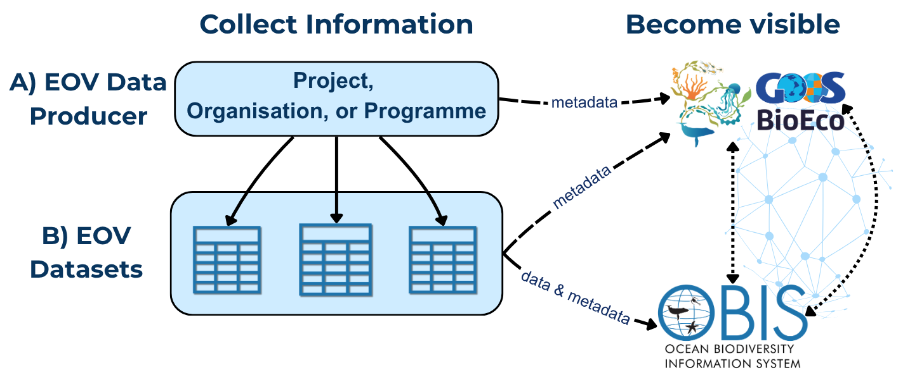
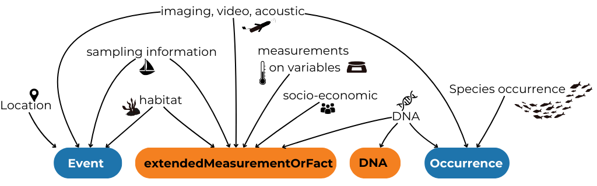
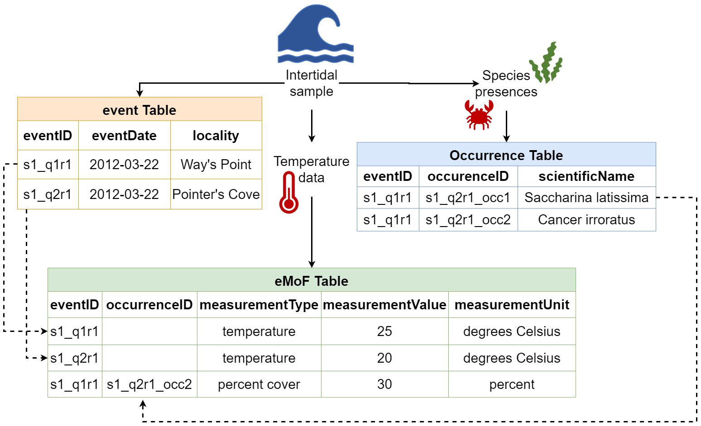
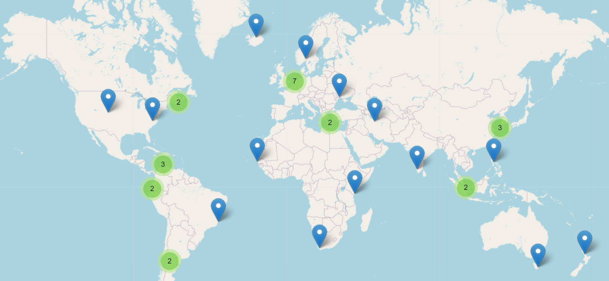

# Data and Information Management for EOVs

The GOOS approach to data management is aligned with open data and FAIR (Findable, Accessible, Interoperable, Reusable)[^1] practices. All EOV data and information is valuable, thus effective data management practices are essential to ensure it remains accessible and (re)usable for now and future generations. This document explains how to contribute **EOV data to the global ocean observing system** across different scenarios: an individual researcher submitting data, or an existing data centre connecting to the system.

**Please follow these practices carefully, as EOV data FAIRness relies on compliance[^2] with the guidelines below.**

<h2 id="glossary">Glossary</h2>

<b>Metadata:</b> data or information that describes data. It's information that helps others find, understand, and properly use data - i.e. the "Who, What, When, and Where". In the context of EOV monitoring, this can refer to the information about a monitoring effort (e.g. programme, project, institution, etc.) or about the data produced from that monitoring effort.
  
<b>Dataset:</b> the actual <b>observational data</b> dervived from a sampling event, observation, measurement or other collection process. The specific digital file containing the raw and/or processed information. Preference is to align data to a standard, e.g. Darwin Core for biological data. Dataset metadata describes its content, e.g. taxonomic coverage, specific dates, technical methods used, specific geographic location, and individuals involved in sampling.
  
<b>Data Producer:</b> the entity responsible for generating or collecting EOV information. Can be an organization, project, institution, research group, or monitoring program. Metadata about data producers describes the <b>source</b> of the data, e.g. program name, geographic coverage, generic sampling approaches, sampling frequency.

<h2>Two Steps to Contribute</h2>
The main steps to contribute data to the global system are:
<ol>
<li><b>Become Discoverable</b>: add your monitoring programme metadata to the BioEco Portal</li>
   <ol type="a">
      <li>Confirm if a record of data producer (e.g., organisation, programme, project, etc.) and/or datasets are already visible in the BioEco Portal</li>
      <li>Submit metadata via the <b>EOV Metadata Application</b>. A GitHub account is required</li>
   </ol>
<li><b>Publish EOV observational datasets:</b></li>
   <ul>
      <li>OBIS (Ocean Biodiversity Information System) is the recommended repository for all BioEco observation-based data. Publishing to OBIS makes data openly accessible and integrates it into a global database that enables global assessment of ocean health. Contact a regional or thematic OBIS Node or the OBIS helpdesk (helpdesk@obis.org) for help with data formatting and submission.</li>
   </ul>
</ol>

Making your data producer discoverable by adding your metadata to the BioEco Portal is the <b>minimum step</b>. Regardless of where the actual data is stored, metadata of its existence must be findable.

Please note the differentiation between the **EOV datasets** and the **EOV data producers** throughout this document (see <a href="#what-is-metadata">Glossary</a>). This distinction is made to emphasize that both the data and its source \- the data producer \- need to be managed and made visible.

## Step 1a. Become Discoverable: Confirm Visibility

Before initiating data flow, you must ensure that key metadata about the EOV data producer (i.e. the project, programme, or organisation) is up to date, verifiable, and FAIR within the BioEco Portal. Follow these steps:

i) **Check if record already exists:** Search the [BioEco Portal](https://bioeco.goosocean.org/)
   <ul>
      <li>

A record exists?
If you already see your data producer in the GOOS BioEco Portal, verify the information is up to date. If the metadata data needs to be updated, please contact [helpdesk@obis.org](mailto:helpdesk@obis.org) with the GitHub usernames that should have edit access, and we'll get you set up. Then move to Step 1b to update the metadata.
</li>
      <li>Record doesn't exist? Continue to part ii).</li>
   </ul>
ii) **Register in IOC’s [Ocean Expert (OE)](https://www.oceanexpert.org/) for data traceability**: Create a personal and/or organisational account in OE. OE allows you to link persistent identifiers (e.g. ORCiD or ROR).
   * *Note: Account approval takes 1-2 business days. Complete your profile once approved.*
     * OE accounts are email based and thus can only be managed by the person it describes, or through an organisational email for organisations.

## Step 1b. Become Discoverable: Submit Data Producer Metadata

Detailed metadata about the data producer is essential to help others find and understand the EOV monitoring work being done around the world, assess its relevance, credit the right people, and identify collaboration opportunities. The GOOS BioEco Portal uses this information to map who is monitoring which EOVs and where, and is being developed to also display EOV datasets published to OBIS.

**Submit or update a record** using the [**EOV Metadata Application**](https://eovmetadata.obis.org/). It walks you through the required fields, generates the necessary files, and submissions become visible directly in the GOOS BioEco Portal. No technical knowledge is needed but a GitHub account is required to use the tool. Click [here](https://github.com/signup) to sign up to GitHub. Please contact <helpdesk@obig.org> for assistance with the application.

> If you're technically savvy and comfortable with JSON-LD files and sitemaps, you can create the metadata files yourself. See the [ODIS Book](https://book.odis.org/gettingStarted.html) for detailed guidance.

<h4 id="minimum-required-metadata">Minimum required metadata for data producers</h4>

<table>
   <thead>
      <tr><th>Field</th><th>Description</th></tr>
   </thead>
   <tbody>
      <tr><td>Title/Name</td><td>Name of the project, programme, organisation, or other group conducting sustained EOV monitoring</td></tr>
      <tr><td>Data producer identifier</td><td>An identifier associated with the project, programme, institution, etc. This will be the same identifier used in the metadata for generated datasets, so the records can be linked.</td></tr>
      <tr><td>Abstract or description</td><td>Brief description of the data producer</td></tr>
      <tr><td>Landing page URL</td><td>A stable link to more information about the data producer</td></tr>
      <tr><td>Contact Email</td><td>A point of contact, could be an individual, general inquiries, helpdesk, etc.</td></tr>
      <tr><td>EOVs Keywords</td><td>The specific EOVs being monitored</td></tr>
      <tr><td>Temporal coverage</td><td>The start and end date of the monitoring efforts; end date is optional if efforts are ongoing</td></tr>
      <tr><td>Geographic location</td><td>The general location where monitoring takes place (e.g. bounding box, point location)</td></tr>
      <tr><td>Sampling approach</td><td>The general methodological approach used, ideally mapped to GOOS Platform types (e.g. <a href="https://www.ocean-ops.org/api/help/?param=platformfamily">platform family</a>)</td></tr>
   </tbody>
</table>

## Step 2. Prepare and Publish EOV Data

We encourage the “Publish once harvest many times” principle: publish your data to one trusted repository, and it will flow automatically to connected systems. Where you publish depends on your data type, but the repository must be interoperable with the data systems used by GOOS, IODE, and other IOC entities. OBIS is the recommended repository for all BioEco EOV observation-based data.

<h4 id="why-obis">Why OBIS?</h4>

All data in OBIS follows the international  <a href="https://dwc.tdwg.org/"><b>Darwin Core</b></a> (DwC) data standard, which ensures datasets are consistent, interoperable, and discoverable across global systems, including with other biological domains like terrestrial systems represented in GBIF. You don't need to be familiar with the standard to get started, but we recommend using <b><a href="https://dwc.tdwg.org/terms/">using DwC terms</a> as column names</b> in your data files from the outset if possible, as this will simplify the process.

OBIS can host observation-based datasets such as those derived from field samples, acoustic surveys, satellite imaging, animal tracking, DNA sequencing, etc. (Figure 2).

There are three main scenarios for BioEco observational data:

<ol type="a">
  <li>[Publish BioEco data directly to OBIS](#step-2a.-publish-bioeco-data-directly-to-obis)</li>
  <li>[Connect an existing data portal to OBIS](#step-2b.-connect-an-existing-data-portal-to-obis)</li>
  <li>[Publish non-BioEco data](#step-2c.-publish-non-bioeco-data)</li>
</ol>

#### Observation Dataset metadata

As opposed to data producer metadata, metadata describing the observational dataset should be **submitted directly** to the repository where the data is hosted (e.g. OBIS). Dataset metadata may include but is not limited to information about the taxonomic coverage, temporal and geographic area, sampling methods used, people involved, and the project producing the data (including identifiers to link the dataset with the data producer).

<h4>Minimum required <u>metadata</u> for OBIS observation datasets</h4>

<table>
   <thead>
      <tr><th>Field</th><th>Notes</th></tr>
   </thead>
   <tbody>
      <tr><td>Title</td><td>Descriptive name for the dataset</td></tr>
      <tr><td>Abstract or description</td><td>Brief description of the dataset</td></tr>
      <tr><td>Citation</td><td>(can be automatically generated on the IPT)</td></tr>
      <tr><td>Contact point</td><td>Person or team responsible</td></tr>
      <tr><td>Data producer identifier</td><td>An identifier associated with the project, programme, institution, etc. This should be the same identifier used in the metadata for the data producer so the records can be linked. Identifiers can be added to datasets after publication if you do not have one at the time of publication</td></tr>
      <tr><td>EOV keyword(s)</td><td>The EOVs covered by the dataset, use controlled vocabulary</td></tr>
   </tbody>
</table>

### Step 2a. Publish BioEco data directly to OBIS

All BioEco data published to OBIS must include three core elements: **when** the observation occurred, **where** it occurred, and **what** was observed (i.e. a taxonomic identification). These can be approximate - a date range, a geometry text string for a polygon or line, or a higher taxonomic rank are all acceptable. See the table below for details on the minimum requirements.

<h4>Minimum required <u>data</u> for OBIS observation datasets</h4>

<table>
   <thead>
      <tr><th>Field</th><th>Notes</th></tr>
   </thead>
   <tbody>
      <tr><td>Coordinates</td><td>of a sampling event and/or biological observation, in decimal degrees</td></tr>
      <tr><td>Date</td><td>of the observation (YYYY-MM-DDTHH:mm:ss)</td></tr>
      <tr><td>Taxon Name</td><td>of the taxon observed, to the lowest possible rank identified (higher ranks are accepted)</td></tr>
      <tr><td>Present / absent</td><td>(DwC term occurrenceStatus)</td></tr>
      <tr><td>Observation type</td><td>(e.g. human vs machine observation, DNA-based; DwC term basisOfRecord)</td></tr>
      <tr><td>Unique observation identifiers</td><td>for all taxonomic observations (DwC term occurrenceID)</td></tr>
   </tbody>
</table>

> Note: Data published to OBIS can be **simultaneously published to GBIF (Global Biodiversity Information Facility),** so you do not need to submit separate datasets! See the [OBIS Manual](https://manual.obis.org/data_sharing.html#publish-obis-data-to-gbif) for more details, or contact OBIS Node who is helping you publish your data.

<h4 id="how-darwin-core-structures-data">How Darwin Core structures data</h4>

DwC organises data into linked tables. Tables are connected by shared identifiers (eventIDs and occurrenceIDs), so data from different tables can be reliably combined. See Figure 3 for an example.

The tables currently implemented by OBIS are:

<ul>
   <li><b>Sampling-Event</b> Where, when, and how sampling occurred (e.g. location, depth, methods, etc.)</li>
   <li><b>Occurrence</b> What was observed (biological records, sequence-based detections, historical observations)  </li>
   <li><b>ExtendedMeasurementOrFacts</b> Any biotic/abiotic measurements, sampling facts, environmental conditions, or relevant information  </li>
   <li><b>DNADerivedData</b> Sequences, primers, and other molecular information</li>
</ul>

#### Raw or original data

The raw or original data used to identify an observation (e.g. images, recordings, DNA sequences) should be deposited in an appropriate repository according to the repository's formatting standard (e.g.[NCBI](https://www.ncbi.nlm.nih.gov/), [EcoTaxa](https://ecotaxa.obs-vlfr.fr/), image hosting platforms, regional or national repositories, etc.), with links to these resources included in you DwC dataset. The [OBIS Manual](https://manual.obis.org/) provides comprehensive guidance on how to align to DwC standards. OBIS regional and thematic nodes are also available to assist you with data formatting.

### Step 2b. Connect an existing data portal to OBIS

If your institution already publishes data through its own portal or repository, it may be possible to connect that system to OBIS. To do this, the **data must be structured in Darwin Core format,** and the portal needs to be connected to an Integrated Publishing Toolkit (IPT) - the software OBIS uses to harvest data.

If your portal isn't already connected, this typically involves a workflow that:

1. Extracts the data from your institutional repository,  
2. Formats it to align with DwC, and  
3. Transfers it to an IPT, which OBIS can then harvest

For help setting this up, contact the OBIS Secretariat at ([helpdesk@obis.org](mailto:helpdesk@obis.org)), or a regional/thematic [OBIS Node](https://obis.org/contact/). If you publish data from systems like NCEI or ERDDAP, becoming an OBIS Node (or partnering with one) may be the best path forward. The OBIS Secretariat can  guide you through [the process](https://manual.obis.org/nodes.html#tor-of-obis-nodes), or connect you with an appropriate OBIS node (Figure 4).

<h4>Already publishing to EMODnet or ICES?</h4>

EMODnet Biology is managed through EurOBIS, a regional OBIS node - which means that data in EMODnet Biology is already flowing into OBIS. No additional steps are needed.
  
<a href="https://www.ices.dk/">ICES (International Council for the Exploration of the Sea)</a> contributes data to EMODnet Biology, Physics, and Chemistry, so some biological data may already reach OBIS via EurOBIS. However, this pathway is not automatic or guaranteed for all datasets. We recommend checking whether your data is already visible in OBIS. If it isn't, publishing directly through an OBIS node is the most reliable route.
  
For EMODnet Physics and Chemistry data not covered by the above, a direct connection to OBIS does not currently exist. At minimum, ensure your data producer is visible in the BioEco Portal (see Section 1) so your work remains findable.

### Step 2c. Publish non-BioEco data

Non biological data collected must also be made FAIR. As a reminder, we encourage any non-BioEco data that was taken at the same time as BioEco data to be published together in OBIS. To do this, you can utilise the ExtendedMeasurementOrFact table. Using this approach will avoid datasets being split into several separate datasets, which are then difficult to combine again. Ensure identifiers for the associated projects, people, institutions, etc. are included in all metadata so they can be connected. Specific details on using this table are outlined in the [OBIS Manual](https://manual.obis.org/format_emof.html).

For guidance on data flows for physical or biochemical data not collected alongside BioEco data, please refer to the [relevant EOV specification sheet](https://goosocean.org/what-we-do/framework/essential-ocean-variables).

Metadata about observing platforms should be made available through the GOOS [OceanOPS](https://www.ocean-ops.org/). See [https://www.ocean-ops.org/metadata/](https://www.ocean-ops.org/metadata/#background) for guidance.

### Data licensing

All data published to OBIS is open-access. However datasets may select one of three Creative Commons licenses: **CC0, CC BY, CC BY-NC**. For details on the data policy of OBIS, see the [OBIS website](https://obis.org/data/datapolicy/) and the [OBIS Manual](https://manual.obis.org/policy.html).

## Verify Visibility

To verify that your (meta)data are Findable (the F of FAIR), check that the name of your entry appears in the [GOOS BioEco Portal](https://bioeco.goosocean.org/).

To verify that BioEco datasets published to OBIS are accessible (the A of FAIR), search by dataset name through the OBIS Mapper ([https://mapper.obis.org/](https://mapper.obis.org/)) or the Homepage portal ([https://obis.org/search?entity=dataset](https://obis.org/search?entity=dataset)).

## Get help

### Help with OBIS

The [OBIS Manual](https://manual.obis.org/), [OBIS Nodes,](https://obis.org/about/nodes/) or the OBIS helpdesk ([helpdesk@obis.org](mailto:helpdesk@obis.org)) can assist with formatting and publishing. We recommend identifying a regional or thematic Node to help you (Figure 4). If your dataset is incomplete or historical, don't be discouraged - OBIS Nodes can also help assess what's usable and how to handle gaps! For historical data, the [Oceans Past Initiative](https://oceanspast.org/) is a thematic OBIS Node that specifically handles historical marine data.

The [EOV Metadata Application](https://eovmetadata.obis.org/home) is also under development to offer the option of uploading a file aligned to a user-friendly "EOV-format", and guide you through the process of converting your data into DwC tables.

**Helpful Links**

* OBIS Manual: [https://manual.obis.org/](https://manual.obis.org/)
* OBIS YouTube data formatting and publishing videos: [https://www.youtube.com/playlist?list=PLlgUwSvpCFS4TS7ZN0fhByj\_3EBZ5lXbF](https://www.youtube.com/playlist?list=PLlgUwSvpCFS4TS7ZN0fhByj_3EBZ5lXbF)
* Darwin Core term reference list: [https://dwc.tdwg.org/terms/](https://dwc.tdwg.org/terms/)
* WoRMS taxonomy: [https://www.marinespecies.org/](https://www.marinespecies.org/)
* DwC spreadsheet template generator [https://www.nordatanet.no/aen/template-generator/config%3DDarwin%20Core](https://www.nordatanet.no/aen/template-generator/config%3DDarwin%20Core)
* BioData Guide with example code for transforming datasets to DwC: [https://ioos.github.io/bio\_data\_guide/](https://ioos.github.io/bio_data_guide/)

### Other Resources

* EOV Metadata Application: [https://eovmetadata.obis.org/](https://eovmetadata.obis.org/)
* Access the Portal: [https://bioeco.goosocean.org/](https://bioeco.goosocean.org/)
* Ocean Best Practices System – Search for best practices: [https://search.oceanbestpractices.org/](https://search.oceanbestpractices.org/)

[^1]:  Wilkinson et al. 2016 <https://doi.org/10.1038/sdata.2016.18>

[^2]:  In evaluations of programmes, projects, or other initiatives which claim EOV data generation, evaluators are encouraged to verify that data is discoverable and accurately represented in the GOOS BioEco Portal.

[^6]:  E.g. phylogenetic/functional DNA sequence data in the European Nucleotide Archive, biological and associated data in OBIS, images in institutional repositories, acoustic data in a regional data hub, etc.
