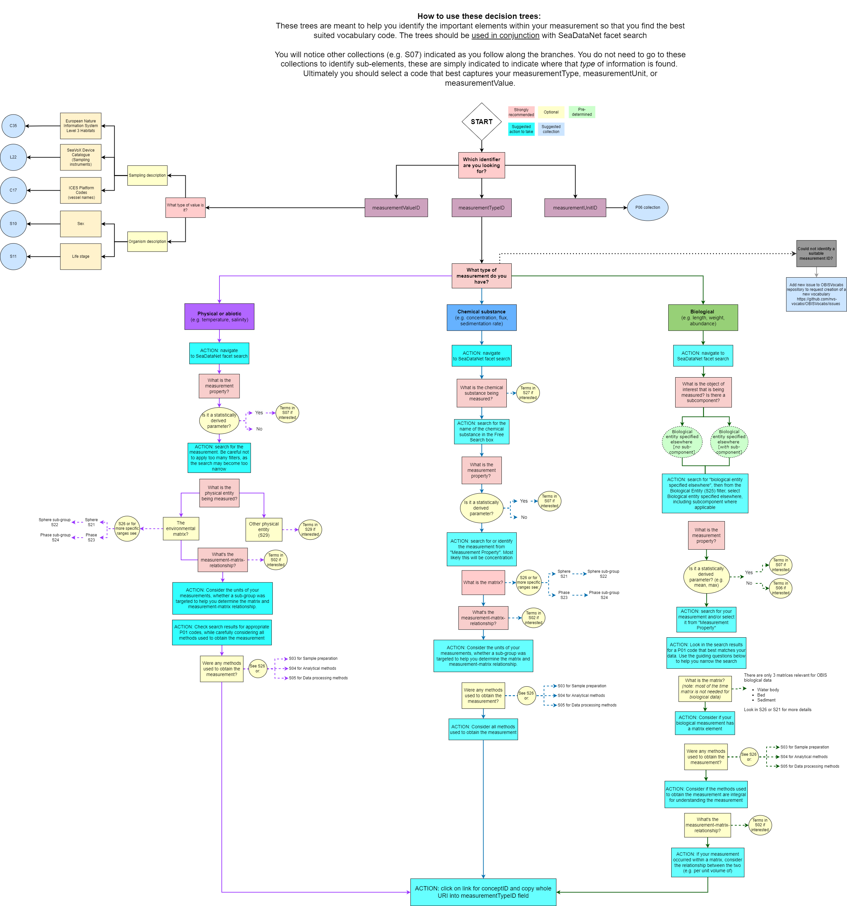

## Choosing vocabularies for your dataset

**Content**

* [Map data fields toDarwin Core](#map-data-fields-to-darwin-core)
* [Map eMoF measurement identifierss](#map-data-fields-to-darwin-core)
  * [MeasurementOrFact vocabulary background](#measurementorfact-vocabulary-background)
  * [Guidelines to populate measurementUnitID](#guidelines-to-populate-measurementunitid)
  * [Guidelines to populate measurementValueID](#guidelines-to-populate-measurementvalueid)
  * [Guidelines to populate measurementTypeID](#guidelines-to-populate-measurementtypeid)

### Map data fields to Darwin Core

There are many possible ways of setting up your datasheets, and if you are new to OBIS you likely did not use controlled Darwin Core (DwC) or BODC vocabulary before samples were collected. In mapping your data fields to DwC we recommend documenting your choices so you have a reference to go back to should the need arise. In such a document you should take notes on the choices you made, as well as any actions you had to take (e.g. separate one column into many, convert dates or coordinates, etc.).

For example, a DwC mapping reference table could look like the following:

| Verbatim field name | Mapped DwC term | Actions taken | Notes |
|-------|-------|------------|--------------|
| date | eventDate | convert dates to ISO |  |
| coordinates| decimalLongitude, decimalLatitude | convert ddmmss to decimal degrees, separated one column into 2 for longitude and latitude | put original coordinates into verbatimCoordinates |

In order to help you map your data to DwC terms, we have provided the table below which outlines some common data fields, their associated Darwin Core vocabulary, and which data table the field is likely to go in:

| Common Raw Terms | DwC Field | Data table |
----------------- | ----------------------------- | ---------
Date, Time | eventDate | Event, Occurrence
Species, g_s, taxa | scientificName | Occurrence
Any biotic/abiotic measurements* | measurementType, measurementValue, measurementUnit* | eMoF
Depth | maximumDepthInMeters or minimumDepthInMeters | Event, Occurrence
Lat/Latitude, Lon/Long/Longitude, dd | decimalLatitude, decimalLongitude | Event, Occurrence
Sampling method | samplingProtocol | eMoF
Sample size, N, #, No. | sampleSizeValue | eMoF
Location | locality | Event
Presence, absence | occurrenceStatus | Occurrence
Type of record/ specimen | basisofRecord | Occurrence
Person/ people that recorded the original Occurrence | recordedBy | Occurrence
OrcID of person/ people that recorded the original Occurrence | recordedByID | Occurrence
Person/ people that identified the organism | identifiedBy | Occurrence
OrcID of person/ people that identified the organism | identifiedByID | Occurrence
Data collector, data creator | recordedBy | Event, Occurrence
Taxonomist, identifier | identifiedBy | Occurrence
Record number, sample number, observation number | occurrenceID (either ID or incorporated into ID) | Occurrence

*Note that mapping abiotic/biotic measurement fields (sex, temperature, abundance, lengths, etc.) will occur within the [extendedMeasurementOrFact extension](format_emof.html). Here this data will go from being a separate column to being condensed into the `measurementType` and `measurementValue` fields.*

The obistools R package also has the [map_fields function](https://github.com/iobis/obistools#map-column-names-to-darwin-core-terms) that you can use to map your dataset fields to a DwC term.

## Map eMoF measurement identifiers to preferred BODC vocabulary

### MeasurementOrFact vocabulary background

The MeasurementOrFact terms `measurementType`, `measurementValue`, and `measurementUnit` are completely unconstrained and can be populated with free text. While free text offers the advantage of capturing complex and as yet unclassified information, there is inevitable semantic heterogeneity (e.g., of spelling, wording, or language) that becomes a challenge for effective data interoperability and analysis. For example, if you were interested in finding all records related to length measurements, you would have to try to account for all the different ways “length” was recorded by data providers (length, Length, len, fork length, etc.).

> Use the [OBIS Measurement Type search tool](https://mof.obis.org/) to see the diversity of `measurementTypes` that exist across published datasets in OBIS. Note that any `measurementTypeIDs` listed in this tool are **solely** for consultation purposes. In some cases codes may have been incorrectly chosen for the associated `measurementType`. You should always choose `measurementTypeIDs` based on your own data and the guidelines in this manual.

The 3 identifier terms `measurementTypeID`, `measurementValueID` and `measurementUnitID` are used to standardize the measurement types, values and units.

These three terms should be populated using controlled vocabularies referenced using Unique Resource Identifiers (URIs). For OBIS, we recommend using the internationally recognized [NERC Vocabulary Server](http://www.bodc.ac.uk/resources/products/web_services/vocab/), developed by the British Oceanographic Data Centre (BODC). This server can be accessed through:

* NERC Vocabulary Server (NVS) search <https://www.bodc.ac.uk/resources/vocabularies/vocabulary_search/>
* Semantic Model Vocabulary Builder <https://www.bodc.ac.uk/resources/vocabularies/vocabulary_builder/>
* SeaDataNet facet search <https://vocab.seadatanet.org/p01-facet-search>

Controlled vocabularies are incredibly important to ensure data are interoperable - readable by both humans and machines and that the information is presented in an unambiguous manner. Vocabulary collections like NERC NVS2 compile vocabularies from different institutions and authorities (e.g., ISO, ICES, EUNIS), allowing you to map your data to them. In this way, you could search for a single `measurementTypeID` and obtain all related records, regardless of differences in wording or language used in the data.

Each vocabulary “term” in NVS is a concept that describes a specific idea or meaning. For consistency, we refer to individual vocabularies in NVS as **concepts**. Concepts within NVS are organized into *collections* that group concepts with commonalities (e.g. all concepts pertaining to units). Sometimes collections contain concepts that are deprecated. Terms can be deprecated due to duplication of concepts, or when a term becomes obsolete. You should not use any deprecated concepts for any measurement ID. Deprecated concepts can be identified from lists on NVS because their identifier will have a red warning symbol, and the page for the term itself will indicate the concept is deprecated in red lettering. Unfortunately, there is currently no notification system in place to automatically warn you if a previously used concept has become deprecated. We recommend occasionally confirming that the concepts you or your institution use are still available for use.

Guidelines for populating each mesaurement ID are described below.

#### Guidelines to populate measurementUnitID

The `measurementUnitID` field is the easiest measurement ID field to populate. It is used to provide a URI for the unit associated with the value provided to measurementValue (e.g. cm, kg, kg/m2). This field should be populated with concepts from the **P06 collection**, BODC-approved data storage units. Documentation for this collection can be found [here](https://github.com/nvs-vocabs/P06).

The entire vocabulary list, including deprecated terms can be found at <http://vocab.nerc.ac.uk/collection/P06/current>. However, we strongly recommend using <https://www.bodc.ac.uk/resources/vocabularies/vocabulary_search/P06/> to avoid potentially selecting deprecated terms.

Some examples of `measurementUnits` and the associated `measurementUnitID` include:

* Metres: <http://vocab.nerc.ac.uk/collection/P06/current/ULAA/>
* Days: <http://vocab.nerc.ac.uk/collection/P06/current/UTAA/>
* Metres per second: <http://vocab.nerc.ac.uk/collection/P06/current/UVAA/>
* Percent: <http://vocab.nerc.ac.uk/collection/P06/current/UPCT/>
* Milligrams per litre: <http://vocab.nerc.ac.uk/collection/P06/current/UMGL/>

#### Guidelines to populate measurementValueID

The `measurementValueID` field is used to provide an identifying code for `measurementValues` that are **non-numerical** (e.g. sampling related, sex or life stage designation, etc.).
**Note: it is not used for standardizing numeric measurements!**

Unlike `measurementUnitID`, there is more than one collection which may be used to search for and use concepts from. The collection is dependent on which type of `measurementValue` you have. See the table below for some common, non-exhaustive examples.

| Type of measurementValue | Collection | Collection Documentation| Complete Vocabulary List|
|--------------------------|------------|-------------------------|-------------------------|
|Sex (gender)| [S10](https://www.bodc.ac.uk/resources/vocabularies/vocabulary_search/S10/) | <https://github.com/nvs-vocabs/S10> | <http://vocab.nerc.ac.uk/collection/S10/current/|>
|Lifestage | [S11](https://www.bodc.ac.uk/resources/vocabularies/vocabulary_search/S11/) | <https://github.com/nvs-vocabs/S11> | <http://vocab.nerc.ac.uk/collection/S11/current/> |
|Sampling instruments and sensors (SeaVoX Device Catalogue)| [L22](https://www.bodc.ac.uk/resources/vocabularies/vocabulary_search/L22/) | <https://github.com/nvs-vocabs/L22> | <http://vocab.nerc.ac.uk/collection/L22/current> |
|Sampling instrument categories (SeaDataNet device categories) | [L05](https://www.bodc.ac.uk/resources/vocabularies/vocabulary_search/L05/) | <https://github.com/nvs-vocabs/L05> | <http://vocab.nerc.ac.uk/collection/L05/current|>
|Vessels (ICES Platform Codes) | [C17](https://www.bodc.ac.uk/resources/vocabularies/vocabulary_search/C17/) | - | <http://vocab.nerc.ac.uk/collection/C17/current> |
| European Nature Information System Level 3 Habitats | [C35](https://www.bodc.ac.uk/resources/vocabularies/vocabulary_search/C35/) | - | <https://vocab.nerc.ac.uk/collection/C35/current/>  |

You can also populate `measurementValueID` with references to papers or manuals that document the sampling protocol used to obtain the measurement. To do this you should use either:

* The DOI of the paper/manual
* Handle for publications on IOC's [Ocean Best Practices repository](http://www.oceanbestpractices.net/), e.g. [http://hdl.handle.net/11329/304](http://hdl.handle.net/11329/304)

#### Guidelines to populate measurementTypeID

##### The P01 Collection

One of the more important collections for OBIS is the [P01 collection](http://vocab.nerc.ac.uk/search_nvs/P01/?searchstr=&options=identifier,preflabel,altlabel,status_accepted&rbaddfilter=inc&searchstr2=).

> Important note!
> **P01 codes are required for the `measurementTypeID` field**.

The P01 is a large collection with >45,000 concepts. Each concept within this collection is composed of different elements that, together, construct a label you can use for a measurement type. Frequently, concepts from the P01 collection are referred to as a “P01 code”. P01 codes are used to populate the `measurementTypeID` field.

It is important to know that a semantic model, shown below, underlies each P01 code and the elements that compose them. There are 5 potential elements in this semantic model that, together, unambiguously describe a measurement type. See the [P01 wheel](https://github.com/nvs-vocabs/P01/blob/master/P01_wheel.pdf) for example of how these elements relate and combine to make one P01 code.

* **Property/attribute**: the measurement or observation of either an object of interest or a matrix, or both
* **Object of interest**: a chemical object, a biological object, a physical phenomenon, or a material object
* **In relation to**: how the measurement is related to the environment
* **Environmental matrix**: what environment the measurement is in (e.g. water body, seabed); needed for most environmental measurements, but may not be necessary for e.g. biological measurements
* **Method**: any specific methods used that are important to interpret the measurement

Note: Not every element is required, but it is important to think about each piece of the model and how it may or may not apply to your measurement. More details about this are described below in the mesaurementTypeID section.

You can use codes from other collections (e.g. P06, Q01) for `measurementValueID` and `measurementUnitID` fields, but for `measurementTypeID` you must always use a code from the P01 collection (limited exceptions, see below).

##### Selecting P01 codes for measurementTypeID

When selection P01 codes, it is important to understand that each element within a P01 code is meant to describe an aspect of the measurement: what is the measurement, what is the object or entity being measured, in what environment was the measurement taken, by what kind of methods, etc.? By taking together all these elements, we are able to have a unique and specific description to differentiate one measurement from another. More documentation about the P01 code and the semantic model it is based on can be found [here](https://github.com/nvs-vocabs/P01).

The P01 collection is found [here](http://vocab.nerc.ac.uk/collection/P01/current/) and can be [searched through the NERC vocabulary server](https://vocab.nerc.ac.uk/search_nvs/P01/).

You may notice when searching for measurement types related to an occurrence that specific taxonomic codes are available to you, e.g., abundance of Notommata. For OBIS, **all P01 codes should be generalized** - i.e. **do not** select species-specific codes. Instead only choose codes for “biological entities specified elsewhere” when the measurement is related to an occurrence record.

There are several ways of searching for a P01 code, but we highly recommend using the [SeaDataNet P01 Facet Search](https://vocab.seadatanet.org/p01-facet-search). You may notice when searching for measurement types related to an occurrence that specific taxonomic options are available to you, e.g., abundance of Notommata. For OBIS, **all P01 codes should be generalized** - i.e. do not select species-specific codes. Instead, only choose codes for “biological entities specified elsewhere”! This is due to the Darwin Core Archive structure - taxonomic identification is already specified in the Occurrence table, but measurements are recorded in the ExtendedMeasurementOrFact table.

When you are comfortable and understand P01 codes, you can also use the [BODC Vocabulary Builder](https://www.bodc.ac.uk/resources/vocabularies/vocabulary_builder/) or simply search for terms directly on the [NERC Vocabulary Server](http://vocab.nerc.ac.uk/search_nvs/).

For measurementTypes related to sampling instruments and/or methods attributes, see the Q01 collection:

* Vocabulary: [http://vocab.nerc.ac.uk/collection/Q01/current/](http://vocab.nerc.ac.uk/collection/Q01/current/)
* Search: [https://www.bodc.ac.uk/resources/vocabularies/vocabulary_search/Q01/](https://www.bodc.ac.uk/resources/vocabularies/vocabulary_search/Q01/)

Use the follow decision tree to help you select P01 codes for biological, chemical, and/or physical measurements.

### Requesting new vocabulary terms

If you have already tried looking for a P01 code and were unable to identify a suitable code for your `measurementType` you must then request a code to be created. Before doing so, make sure you have not over filtered the search results. Then, to request a new term, your request must be submitted via:

* Submit request through the OBIS Vocabulary GitHub repository (<https://github.com/nvs-vocabs/OBISVocabs/issues>)
  * Requests can also be emailed to vocab.services@bodc.ac.uk if you cannot access GitHub
* Registration with the [BODC Vocabulary Builder](http://vocab.nerc.ac.uk/collection/P01/current/ENTSEX01/)
  * Note: these requests should be based on combinations of existing concepts

We strongly recommend you use GitHub if you can, as it allows longer-term documentation, and can be relevant for other users who may be interested in the same type of code creation.

Finally, if you are unsure about whether a code fits your specific case, please feel free to ask questions to the Vocab channel on the [OBIS Slack](https://join.slack.com/t/obishq/shared_invite/zt-1yiucrrrq-RZRPU7c4rm7OungiBseWVA).

#### How to Submit a GitHub Vocabulary Request

1. Navigate to <https://github.com/nvs-vocabs/OBISVocabs/issues> and click on the New Issue button.

{width=50%}

2. Click Get started

{width=80%}

3. Fill in the title with short details of your request or issue. Then fill in the description. It is recommended to list any existing terms that are similar to your request, or concepts that are sub-components of the request.

{width=50%}

4. *Example*: An issue was created to address difficulties in identifying P01 codes for sex rather than gender. Gender is a concept generally applied to humans, whereas “sex” is more applicable for animals. Thus the request was to either modify the current gender P01 code, or create a P01 code that specifies sex, not gender. At the time the request was issued, when users searched for a P01 term for “sex”, only species-specific terms were available.

{width=80%}
